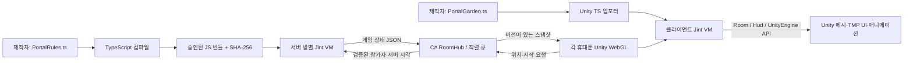
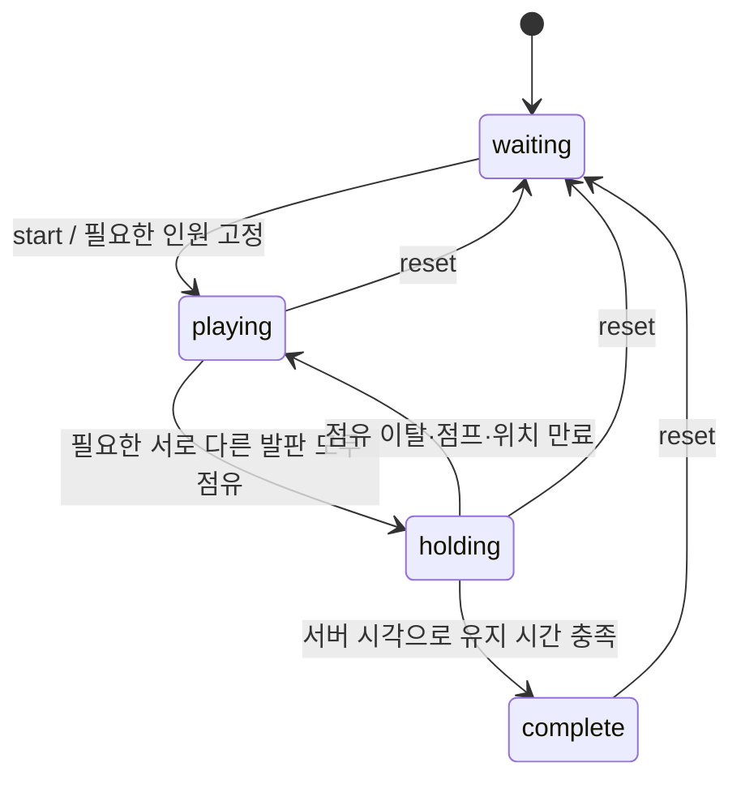
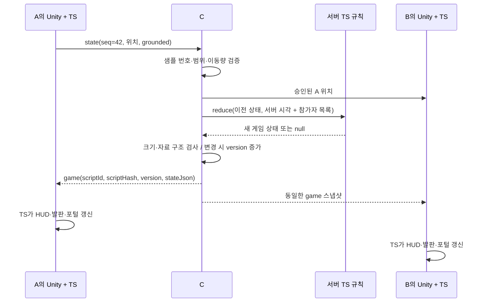

# Kimchily — TypeScript로 제작하는 멀티플레이 UGC

이 문서는 Chili Island의 실제 코드 구조, 서버 판정, 상태 동기화, TS 스크립팅의 역할과 검증 범위를 설명한다. 포트폴리오 설명과 이후 코드 분석의 출발점으로 사용한다. 변경 이력의 이전 버전은 C# 고정 프리셋이었으며, 현재 구조는 서버 규칙과 클라이언트 게임 진행을 TS로 분리한다.

## 1. 포트폴리오에 쓸 수 있는 설명

> Unity WebGL 기반 UGC 제작 도구에 TypeScript 게임 스크립팅과 멀티플레이 동기화를 구현했습니다. 제작자가 작성한 TS를 JavaScript로 컴파일하여 클라이언트와 C# 서버 내부의 제한된 Jint VM에서 각각 실행합니다. 서버는 검증된 위치와 서버 시각을 TS 규칙에 입력하고, 판정 결과에 버전을 부여해 참가자에게 전달합니다. 클라이언트 TS는 동일한 결과로 발판·포털·TMP UI를 갱신합니다. 게임별 규칙과 문구를 C#에 하드코딩하지 않도록 일반 통신·실행 호스트와 콘텐츠 스크립트를 분리했습니다.

강조할 구현 사항은 다음과 같다.

- 기존 C# 서버의 방 관리와 직렬 작업 큐를 재사용했다.
- 발판 점유·인원·유지 시간·승리·재시작은 서버 TS가 계산한다.
- 버튼 행동·문구·진행률·메시 활성화·애니메이션은 클라이언트 TS가 작성한다.
- 서버가 정한 상태 버전으로 오래된 결과의 역적용을 막고, 늦게 입장한 사용자도 현재 상태를 받는다.
- 콘텐츠가 규칙의 ID와 SHA-256을 지정해 기대하지 않은 규칙 버전으로 실행되는 것을 막는다.
- TS 실행 시간·연산·메모리 및 메시지 크기 등을 제한한다. 이는 별도 프로세스 격리와 같지는 않다.

실제 여러 휴대폰의 동시 플레이 검증과 브라우저/자동화 검증은 구분해서 제시한다. 프레임률, 동시 접속 성능, 안티치트 수준 등 측정하지 않은 수치는 성과로 주장하지 않는다.

## 2. 왜 C# 위에 TS가 필요한가

이전 구현에서는 `PortalPuzzle.cs`가 규칙을, `PortalGameHud.cs`가 화면 문구와 버튼 분기를 가지고 있었다. TS가 빛을 켜는 정도만 담당하면 새 게임을 만들 때마다 도구 개발자가 C#을 수정해야 하므로 스크립팅 시연의 설득력이 약했다.

현재의 구분은 **도구 개발자가 한 번 제공하는 기반 기능**과 **게임 제작자가 콘텐츠마다 작성하는 규칙**이다.

| 수정하려는 내용 | 작성 위치 | C# 수정 여부 |
|---|---|---|
| 3초 유지 → 5초 유지 | `PortalRules.ts`의 `config.holdSeconds` | 불필요 |
| 점유 범위·높이·접지 조건 | 서버 TS 규칙 | 불필요 |
| 동시에 밟기 → 순서대로 밟기 | 서버 TS 상태 전이 + 클라이언트 TS 안내/연출 | 기존 API 범위에서는 불필요 |
| 시작·재시작 버튼, 설명 문구 | `PortalGarden.ts`의 HUD 작성 코드 | 불필요 |
| 발판 빛·포털 개방·장식 움직임 | `PortalGarden.ts` | 불필요 |
| 모델·배치·재질 수정 | Unity 씬·프리팹·Inspector | 불필요 |
| 새로운 엔진 접근 기능 제공 | TS SDK의 제한된 C# 브리지 | 필요 |
| 통신 프로토콜·보안 경계 확장 | 공통 C# SDK/서버 | 필요 |

TS가 Unity 엔진이나 네트워크 서버 전체를 대체하는 것은 아니다. 이미 제공된 API 안에서 게임 제작자가 새 콘텐츠를 만들 때 C# 코드와 실행기 전체를 다시 작성하지 않게 하는 것이 목적이다. 새 API를 추가하는 이번 SDK 전환에는 실행기 재빌드가 필요하지만, 이후 지원 API 안에서 게임 규칙과 연출을 바꾸는 작업은 TS/콘텐츠 게시로 수행한다.

`ChiliIslandArt.cs`는 에디터에서 메시와 프리팹을 생성하는 제작 도구이다. 실행 중 발판 판정이나 승리에 관여하지 않는다. 같은 프리팹을 수작업으로 배치해도 게임 TS를 사용할 수 있다.

## 3. 실제 실행 위치



- **서버 TS**는 휴대폰에서 실행하지 않는다. C# 서버 안의 Jint에서 JavaScript 형태로 실행한다.
- **클라이언트 TS**는 Unity 공통 실행기에 들어 있는 Jint에서 실행한다. 브라우저 DOM을 조작하는 웹페이지 스크립트와 별개이다.
- Node는 제작 단계에서 TypeScript를 컴파일할 때 사용한다. 실제 게임 서버를 Node.js로 교체한 구조가 아니다.
- 실행 시 타입 정보는 제거된다. TypeScript 컴파일러의 타입 검사와 런타임 입력 검증은 서로 다른 역할이다.

## 4. 입장과 규칙 연결

1. QR/입장 화면에서 닉네임을 정한다.
2. 공통 실행기가 월드 콘텐츠를 로드하고, 입장 설정을 Unity 네트워크 SDK에 전달한다.
3. WebSocket 연결 후 `join`으로 `worldId`, `revisionId`, `roomId`, 닉네임을 보낸다.
4. 서버는 `(worldId, revisionId, roomId)`가 같은 참가자들을 같은 방으로 묶는다. 같은 방 이름이라도 월드나 게시 버전이 다르면 분리된다.
5. `PortalGarden.ts`가 `Room.useGame(SCRIPT_ID, SCRIPT_HASH)`를 호출한다. 연결 전 호출해도 SDK가 기억했다가 `joined` 후 `watch`를 보낸다.
6. 서버는 해당 세계에 승인된 ID·해시의 번들을 확인하고 방에 규칙 VM을 연결한다. 이미 연결한 방의 규칙을 다른 참가자가 교체할 수 없다.
7. 최초 상태를 보내면 클라이언트 TS가 대기 안내와 시작 버튼을 그린다.

서버 번들은 운영자가 제어하는 로컬 등록 디렉터리에서 읽는다. WebSocket에 JS 코드를 넣어 보내거나 클라이언트가 파일 경로를 지정해서 실행하는 기능은 없다. 해시는 파일 내용의 식별과 불일치 탐지에 사용하며, 작성자의 신원을 보증하는 전자서명은 아니다.

## 5. 캐릭터 위치와 게임 판정은 어떻게 연결되는가

각 클라이언트는 자신의 캐릭터 이동을 즉시 계산한다. 약 0.1초마다 다음 상태를 보낸다.

```json
{
  "protocolVersion": 1,
  "type": "state",
  "state": {
    "sequence": 42,
    "x": -3.0, "y": 0.2, "z": 2.0,
    "yaw": 0, "speed": 0, "grounded": true, "verticalVelocity": 0
  }
}
```

`sequence`는 그 연결에서 증가하는 위치 샘플 번호다. 서버는 이미 처리한 번호 이하의 샘플을 버린다. 숫자가 유한한지, 좌표·속도 범위가 맞는지, 이전 위치에서 시간 대비 너무 멀리 이동하지 않았는지를 검사한다. 과도하게 잦은 위치 전송도 제한한다. 통과한 위치에는 **서버가 받은 시각**을 기록한다.

서버는 그 위치를 다른 참가자에게 전달하고, 게임 TS에는 다음처럼 새 JSON 입력으로 제공한다.

```ts
{
    kind: "tick",
    nowMs: /* 서버의 단조 증가 시각 */,
    players: [{
        playerId: "...",
        name: "새싹",
        state: { x: -3, y: 0.2, z: 2, grounded: true /* ... */ },
        receivedAtMs: /* 이 위치를 서버가 받은 시각 */
    }]
}
```

소켓별 수신은 비동기로 일어나지만 실제 방 변경은 기존 `JobSerializer`의 큐를 통해 직렬로 실행한다. A의 위치, B의 위치, 재시작 요청이 같은 객체를 동시에 수정하지 않는다. 현재 데모는 전체 RoomHub를 공유하는 직렬 실행 구조이며 방마다 독립 스레드를 만드는 구조가 아니다.

## 6. 발판 점유 판정

게임 규칙은 [PortalRules.ts](../KimchilyCreator/ServerScripts/chili-portal/PortalRules.ts)에 있다. 기본 발판은 별 `(-3,0,2)`, 달 `(3,0,2)`, 해 `(-3,0,6)`, 잎 `(3,0,6)`이다.

한 참가자가 특정 발판을 점유하려면 다음 조건을 모두 만족해야 한다.

1. 위치가 존재하고 `grounded === true`여야 한다.
2. 위치 수신 후 1,200ms를 초과하지 않아야 한다. 접속만 유지한 채 위치 갱신이 멈춘 사람은 점유자가 아니다.
3. 이미 다른 발판의 점유자로 선택되지 않았어야 한다.
4. XZ 평면에서 발판 중심과의 거리가 반경 이하여야 한다.
5. 발판 기준 높이와의 차이가 1.5 이하여야 한다.

거리 계산은 제곱근 없이 비교한다.

```ts
const dx = pose.x - pad.x;
const dz = pose.z - pad.z;
const inside = dx * dx + dz * dz <= pad.radius * pad.radius;
```

반경이 1.1이고 `dx=0.5`, `dz=0.4`라면 `0.25+0.16=0.41 <= 1.21`이므로 수평 범위 안이다. 그래도 점프 중이거나 너무 높은 곳에 있거나 위치가 오래되었다면 점유하지 않는다.

참가자를 ID 순서로 순회하고 `used` 집합으로 이미 배정한 사람을 기록한다. 여러 명이 같은 발판에 서도 그 발판은 한 자리만 채워지며, 한 사람이 여러 발판을 동시에 채우지 못한다. 현재 배치는 발판 판정 영역이 겹치지 않는다. 향후 판정 영역이 겹치는 퍼즐을 만들면 최대 매칭 등 다른 배정 규칙이 필요한지 검토해야 한다.

## 7. 시작·유지·승리·재시작



- 대기 중에는 현재 참가 인원에 맞춰 사용할 발판 수를 표시한다.
- 시작 시 필요한 인원을 1~4명 범위로 고정한다. 도중에 사람이 들어오거나 나가도 성공 조건이 갑자기 바뀌지 않는다.
- 모두 점유한 첫 시각을 `_holdingSince`에 기록한다.
- 이후 `nowMs - _holdingSince`로 경과 시간을 계산한다. 휴대폰의 프레임 수·시계·`Time.deltaTime`으로 승리를 결정하지 않는다.
- 필요한 발판 중 하나라도 비면 유지 시작 시각을 지우고 처음부터 다시 센다. 같은 발판을 다른 참가자가 계속 점유하면 유지 시간은 이어진다.
- 성공하면 `complete`를 유지한다. 이후 발판을 떠나거나 새 참가자가 들어와도 포털은 열려 있다.
- 명시적인 `reset` 요청을 받아야 대기로 돌아간다. 인원이 줄었다면 다시 시작해 새 인원에 맞출 수 있다.

호스트는 약 100ms 간격으로 게임을 갱신한다. 입력이 더 오지 않더라도 오래된 위치가 만료되어야 하기 때문이다. 남은 시간은 표시용으로 100ms 단위로 올림한다. 조건 충족에 따른 실제 완료 갱신 시점은 서버 틱과 통신 지연의 영향을 받는다.

## 8. 무엇을 동기화하는가



서버가 각 클라이언트의 Unity 오브젝트를 직접 조작하지는 않는다. 게임 상태 데이터가 동일하게 전달되고, 각 클라이언트의 TS가 그 상태를 자기 씬에 적용한다.

전송 구조는 다음과 같다. `stateJson` 내부 형태는 게임 제작자 TS가 정한다.

```ts
game = {
    scriptId: "chili-portal-ts-v1",
    scriptHash: "<컴파일된 JS의 SHA-256>",
    version: 27,
    stateJson: "{\"phase\":\"holding\",\"remainingMs\":1800,...}"
};
```

C#의 JsonUtility로 게임마다 다른 객체 구조를 역직렬화하지 않도록 문자열 경계를 사용한다. TS SDK가 이를 다시 JSON으로 파싱하고, 분리된 읽기 전용 스냅샷으로 제공한다.

```ts
const room = Room.getState<PortalState>();
const game = room.game?.state;
```

`version`은 서버 호스트가 결과 변경 시 증가시킨다. 클라이언트는 현재 값 이하의 버전을 다시 적용하지 않는다. 이 버전은 캐릭터 위치의 `sequence`와 별개다. 재접속 시 이전 연결의 캐시를 지우며, 늦게 입장하면 `joined`/`watch`로 현재 게임 상태를 받는다. 현재 구현은 변경된 필드만 보내는 델타 압축이 아니라 **변경이 있을 때 게임 상태 전체를 보내는 스냅샷 방식**이다.

원격 캐릭터 위치는 받은 목표 위치를 향해 보간한다. 렌더 프레임마다 `1-exp(-15*dt)` 비율로 가까워지고 큰 차이는 즉시 맞춘다. 따라서 화면에 보이는 캐릭터는 서버에 저장된 최신 위치보다 약간 늦을 수 있다. 승리 판정은 이 시각적 보간 위치가 아니라 서버가 승인한 위치 샘플을 사용한다.

## 9. TS가 UI와 입력까지 제어한다

[PortalGarden.ts](../KimchilyCreator/Assets/Demos/ChiliIsland/Scripts/PortalGarden.ts)는 다음을 모두 작성한다.

```ts
Hud.showPanel({
    eyebrow: "CHILI ISLAND · TYPESCRIPT",
    title: "모이면 시작!",
    body: "같은 QR로 입장해 주세요",
    progress: 0,
    accent: "#8CFABA",
    action: { id: "start", label: "모두 준비됐어요 · 시작", enabled: true }
});

const action = Hud.takeAction();
if (action === "start") Room.sendAction("start");
```

C# `WorldHudPanel`은 특정 게임의 phase나 문구를 모른다. 검증한 DTO를 받아 TMP 텍스트·진행률·버튼으로 표시한다. Unity Button은 JS 함수를 직접 호출하지 않고 액션 ID를 보관한다. TS의 다음 Update가 ID를 가져가 처리하여 VM 재진입을 피한다. UI는 해당 TS Behaviour에 귀속되고 비활성화·리로드·실행 오류·파괴 시 정리한다.

발판의 `active`는 이번 라운드에 필요한 자리인지, `playerId`는 누가 점유했는지를 뜻한다. 필요한 빈 발판은 맥동하고, 점유한 발판은 안정된 빛을 보인다. 성공 시 포털 오브젝트와 셰이더 연출을 켠다. 장식의 맥동은 각 클라이언트의 로컬 시간으로 그려도 게임 결과에 영향을 주지 않는다.

기존 채팅은 별도의 서버 이벤트다. 서버가 보낸 `chat.playerId`로 캐릭터를 찾아 TMP 말풍선을 약 6초 동안 표시한다. 메시지 이력은 방 단위로 관리한다. 이 부분은 어떤 UGC 게임에서도 재사용하는 공통 SDK 기능으로 남긴다.

## 10. 규칙 변경과 배포

1. Creator의 `ServerScripts/chili-portal/PortalRules.ts`를 수정한다.
2. `KimchilyServer/tools/compile-script.ps1`이 고정 버전 TypeScript로 검사·컴파일한다.
3. 승인 디렉터리에 ID/해시별 번들을 만들고 `PortalRuleIdentity.ts`에 동일한 ID/해시를 기록한다.
4. `build_chili_island.ps1 -Publish`는 위 단계를 먼저 수행하고, 생성된 식별자를 포함한 클라이언트 TS/씬을 빌드·게시한다.
5. 새 게시 버전의 사용자는 새 규칙 해시를 요청한다. 이전 해시의 번들도 유지하면 이전 게시 버전은 기존 규칙을 계속 요청할 수 있다.

타입이나 줄바꿈만 달라 컴파일된 JS가 같으면 기존 승인 번들을 다시 사용한다. 기존 파일과 최초 등록의 `sourceHash`는 보존하며, 컴파일 도구의 출력은 이번 입력의 `sourceHash`와 기존 번들의 `bundleSourceHash`를 구분한다. Git의 LF/CRLF 변환 때문에 같은 실행 코드를 다시 등록하지 못하는 문제를 방지한다.

파일 저장만으로 모든 접속 중인 방의 규칙을 즉시 교체하는 기능은 아니다. 방은 연결한 규칙 버전을 유지한다. 개발 도구는 로컬 승인 디렉터리에 배포하며, 원격 운영 서버로의 인증된 업로드·서명·검수 시스템은 별도의 확장 범위다. Unity 일반 Publish 메뉴를 사용할 때도 먼저 서버 TS 컴파일/등록이 필요하며, 데모 전용 CLI는 이 순서를 묶어 제공한다.

## 11. 한계와 설계 선택

- **서버 판정과 서버 물리는 다르다.** 점유·승리의 최종 판정은 서버 TS가 하지만, 이동과 grounded 값의 출처는 클라이언트다. 현재는 범위·빈도·이동량을 검증하며 완전한 안티치트를 보장하지 않는다.
- **Jint 제한은 운영체제 격리가 아니다.** 승인된 스크립트에 CLR·파일·네트워크 객체를 제공하지 않고 실행량을 제한한다. 서버의 8MiB 제한은 Jint 호출별 할당량 기준이며, VM 전체 힙의 상한을 뜻하지 않는다. 신뢰할 수 없는 대규모 사용자 코드를 운영하려면 별도 프로세스 격리·자원 할당·검수가 추가로 필요하다.
- **현재는 메모리 상태다.** 마지막 참가자가 나가면 방과 규칙 VM도 정리한다. 서버 재시작 뒤 진행 중인 방을 복구하는 DB 영속화는 없다.
- **숨긴 탭은 플레이어가 멈춘 것으로 보일 수 있다.** 위치 신선도 조건을 만족하려면 실제 플레이 화면에서 위치가 갱신되어야 한다.
- **모델 배치와 규칙 좌표는 일치해야 한다.** 발판 좌표를 바꾸면 Unity 씬의 발판 배치도 맞춘다. 향후 동일한 레벨 데이터를 양쪽이 읽도록 확장할 수 있다.
- **포털은 완료 연출이다.** 다른 월드로 이동시키는 기능은 아직 연결하지 않았다.
- **규모는 데모 기준이다.** 현재 연결·방·큐 한도와 단일 프로세스 구성을 대규모 운영 성능으로 표현하지 않는다.

## 12. 코드 읽는 순서와 프로젝트 위치

작업본은 `E:\task\KimchilyWebGL`, Git 관리본은 `E:\GItHub\PortFolio\KimchilyWebGL`이다.

| 순서 | 파일 | 읽을 내용 |
|---|---|---|
| 1 | [서버 PortalRules.ts](../KimchilyCreator/ServerScripts/chili-portal/PortalRules.ts) | 실제 게임 규칙·상태 전이 |
| 2 | [클라이언트 PortalGarden.ts](../KimchilyCreator/Assets/Demos/ChiliIsland/Scripts/PortalGarden.ts) | 버튼 요청·상태 소비·UI·연출 |
| 3 | [RoomHub.cs](../KimchilyServer/src/Kimchily.Server.Core/RoomHub.cs) | 참가자·위치 검증·직렬 처리·브로드캐스트 |
| 4 | [ScriptRoomGame.cs](../KimchilyServer/src/Kimchily.Server.Core/ScriptRoomGame.cs) | 범용 JS 실행·입출력 검증·버전 |
| 5 | [ApprovedScriptCatalog.cs](../KimchilyServer/src/Kimchily.Server.Core/ApprovedScriptCatalog.cs) | 규칙 ID/해시·등록 경계 |
| 6 | [ScriptGameClient.cs](../KimchilySDK/Packages/com.kimchily.networking/Runtime/ScriptGameClient.cs) | 구독·재접속·스냅샷 캐시 |
| 7 | [WorldHudPanel.cs](../KimchilySDK/Packages/com.kimchily.networking/Runtime/WorldHudPanel.cs) | 범용 TMP 표시·입력 큐 |
| 8 | [KimchilyTypeScriptBehaviour.cs](../KimchilySDK/Packages/com.kimchily.typescript/Runtime/KimchilyTypeScriptBehaviour.cs) | Unity 생명주기·허용된 TS API 브리지 |

Unity에서 확인할 프로젝트는 `KimchilyCreator`, 씬은 [ChiliIsland.unity](../KimchilyCreator/Assets/Demos/ChiliIsland/Scenes/ChiliIsland.unity)이다. 서버 스크립트는 Unity Behaviour 자산과 구분하려고 `Assets` 밖의 `ServerScripts`에 둔다. 두 곳의 TS가 각기 다른 실행 환경에서 하나의 게임을 구성한다.

검증 수치와 게시 주소는 [검증 기록](chili-island-validation.md)을 함께 참고한다. 이전 C# 프리셋 버전의 기록과 이번 TS 규칙 버전의 기록을 혼동하지 않는다.
