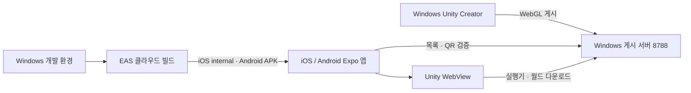

# iPhone / Android 시연 앱과 Windows 월드 서버

작성일: 2026-09-20. 작업 경로는 `E:\task\KimchilyWebGL`이다. 원본 `E:\task\Unity_Project`는 보존했다.

## 구현 결과

React Native + Expo 앱 `KimchilyExpo`를 추가했다. iOS는 EAS internal/ad hoc 설치, Android는 EAS preview APK 설정을 준비했다. 기존 TypeScript와 EAS 요청에 맞춘 구성이다. 현재 iOS 계정에서 Apple 개발자 팀 연결 오류가 발생해 Expo Go 시연 경로도 제공한다.

홈·서버 주소 저장·월드 목록·최근 입장·링크 입력·네이티브 QR 카메라를 구현했다. 카메라는 화면 종료·백그라운드에서 해제하며 중복 인식을 막고, 설정에서 권한을 변경한 뒤 돌아오면 상태를 갱신한다. 서버가 월드 링크와 게시 manifest의 해시를 확인한 뒤 Unity WebGL을 WebView에서 연다. 월드 종료 시 앱 홈으로 돌아온다.

Unity 실행기는 앞서 iPhone Safari에서 실행된 Unity 6 WebGL 빌드를 재사용한다. 기존 Android의 Unity as a Library APK는 원본에 보존했다. 새 Expo 앱에 Unity 네이티브 라이브러리를 포함한 것은 아니다.

## 빌드와 운영

- Expo 프로젝트: [kimchily/kimchily-mobile](https://expo.dev/accounts/kimchily/projects/kimchily-mobile).
- 프로젝트 ID: `5f59c8b9-6991-4594-9e23-b4c861d2b5e7`. `app.config.ts`에 연결했으며 필요하면 `EAS_PROJECT_ID`로 덮어쓴다.
- iOS/Android 식별자: `com.kimchily.mobile`.
- `preview`: iOS internal, Android APK, LAN HTTP 허용. 현재 기본 서버는 `http://192.168.0.4:8788`이며 앱에서 변경·저장한다.
- `production`: HTTPS를 요구하는 별도 프로필. 이번 시연은 preview를 사용한다.
- `tools/run.ps1`은 Node 22.13 이상을 선택하며 이 PC에서는 번들 Node 24를 사용한다. EAS 업로드 범위는 `KimchilyExpo`로 한정한다. Unity 프로젝트·서버 데이터·인증서·로컬 환경 파일은 업로드하지 않는다.

설치용 preview 앱에는 JavaScript 코드가 포함된다. Metro 개발 서버를 켜 둘 필요는 없으며, 월드 실행기와 콘텐츠를 제공하는 Windows 게시 서버는 실행 중이어야 한다. 현재 구성은 같은 Wi-Fi 테스트용이다. EAS가 Windows의 LAN 월드 서버를 대신 호스팅하는 것은 아니다.

Android EAS preview 빌드는 **FINISHED / 성공** 상태다. 버전 0.1.0, versionCode 1, build ID는 `3db01052-2c08-4394-81e8-51d53cfe292e`다. [빌드 상세](https://expo.dev/accounts/kimchily/projects/kimchily-mobile/builds/3db01052-2c08-4394-81e8-51d53cfe292e), [설치용 APK](https://expo.dev/artifacts/eas/QreifKQemhGv3vatzSDPVSXEQlE4i8egrSWMgFkfiz0.apk). 자동 에뮬레이터 설치는 실행하지 않았다.

APK는 `KimchilyExpo/Artifacts/kimchily-preview.apk`에 저장했다. 크기 95,214,599 bytes, SHA-256은 `3fd16406567b069be51baaa03d0eed04744d2b7611fce3302e31df446c89e1d5`다. `aapt`로 `com.kimchily.mobile`, minSdk 24/target 36 및 preview HTTP 허용을 확인했고 `apksigner verify`가 통과했다. 결과는 `KimchilyExpo/Artifacts/android-preview-build.json`에 기록했다. 실제 manifest에는 CAMERA/INTERNET 외 Expo 의존성의 SYSTEM_ALERT_WINDOW와 maxSdk 32 외부 저장소 권한이 포함된다. ADB 설치는 실행하지 않았다.

iOS 빌드 명령은 프로젝트 설정 평가까지 진행했다. Apple 인증에서는 `You have no team associated with your Apple account` 오류가 확인됐다. 현재 로그인 계정에서 개발자 팀을 사용할 수 없어 iOS 클라우드 빌드는 시작하지 않았다. 계정/팀 연결을 해결하기 전 시연은 Expo Go 경로를 제공한다. 설치용 빌드 재개 시 ad hoc 프로필에는 실제 설치할 iPhone이 포함돼야 한다. [EAS 내부 배포 안내](https://docs.expo.dev/build/internal-distribution/)

사용자는 Apple Developer Program 미가입이며 이전 TestFlight 사용은 테스터 경험이었다고 확인했다. 이에 따라 현재 시연 기준은 iPhone Expo Go / Android EAS APK로 정한다. 독립 iOS 앱의 빌드 설정은 향후 서명 준비 시 재사용한다.

## 확인한 범위

| 검사 | 결과 |
| --- | --- |
| Expo TypeScript | 통과 |
| Expo 서버·QR·최근 기록·WebView 정책 테스트 | 28/28 통과 |
| Expo SDK 의존성 호환 검사 | 통과 |
| Preview/production 네이티브 설정 평가 | 22항목 통과. 카메라 권한·오디오 권한 제외·HTTP 정책·프로젝트 연결 확인 |
| iOS / Android / Web JavaScript 번들 생성 | 통과. 네이티브 앱 서명·설치 검증과는 별개 |
| Android EAS preview 네이티브 클라우드 빌드 | 성공. APK 생성, 0.1.0 / versionCode 1 |
| 다운로드한 APK 패키지·서명 | aapt / apksigner 검사 통과, SHA-256 기록 |
| Expo Go 개발 서버 | iOS·Android manifest와 실제 개발 번들 응답 확인. 실기기 검증은 아님 |
| 게시 서버 API·라우팅 테스트 | 30/30 통과 |
| PWA QR·카메라 생명주기·상태 테스트 | 59개 통과 |
| TLS 인증서·프로세스 검증 | 13/13 통과, PS5·PS7 상태 확인 정상 |
| 브라우저 실제 QR PNG / 합성 영상 인식 | 통과. 휴대폰 물리 카메라 검증은 아님 |
| HTTPS 홈 → QR 이미지 → Unity WorldReady → 홈 → 오프라인 홈 | 데스크톱 Chrome 통합 검사 통과 |
| 원본 보존 해시 | 원본 소스 2,148개 · 증빙 8개 · 로컬 패키지 참조 16개 검사 통과 |

iOS와 Android WebView는 네이티브 메시지의 발신 URL 형식이 다르다. 플랫폼별 출처 확인과 주입된 실제 페이지 URL 확인을 함께 적용했고, 실제 Web host의 요청을 사용한 회귀 테스트로 로딩·실패·취소·종료 이벤트를 확인했다. 외부 탐색과 팝업도 제한한다.

네이티브 설정 평가 과정에서 iOS ATS 옵션을 생략하면 Expo의 기본 HTTP 허용 설정이 남는 것을 발견했다. `NSAllowsArbitraryLoads`를 preview에서는 true, production에서는 false로 명시해 두 설정을 실제 평가 결과로 확인했다. Android preview 동작은 바뀌지 않았다. 설정 평가만으로 iOS 네이티브 컴파일이나 기기 실행을 확인한 것은 아니다.

Safari에서 정상 동작했다는 이전 사용자 확인은 유지한다. **새 설치 앱 및 Expo Go의 실제 카메라, WKWebView/Android WebView의 Unity 실행·메모리·GPU·가로/세로 조작은 기기에서 확인해야 한다.** 앱을 설치했다고 월드 전체가 오프라인으로 제공되지는 않는다.

검증 자료: `KimchilyExpo/dist-check/metadata.json`, `KimchilyExpo/Artifacts/dev-server-check.json`, `KimchilyExpo/Artifacts/native-configcheck.json`, `Artifacts/pwa-browser/result.json`, `KimchilyWebApp/tests/artifacts/scanner-browser.json`, `Artifacts/baseline-verification.json`. 의존성 audit 결과는 `KimchilyExpo/Artifacts/audit-runtime.json`에 보관했다. Expo CLI 의존 경로에서 moderate 항목이 남아 있으며 SDK를 구버전으로 바꾸는 자동 강제 수정은 적용하지 않았다.

## 브라우저 보조 경로

`KimchilyWebApp`은 동일 게시 서버의 브라우저 홈/PWA다. 월드 목록·최근 기록·QR 카메라·QR 이미지·링크 입장·오프라인 홈을 제공한다. 로컬 jsQR을 사용하며 서비스 워커는 앱 화면만 캐시한다. Unity 월드와 API·인증서·게시 토큰은 캐시하지 않는다.

웹 카메라용 HTTPS 서버는 `https://192.168.0.4:8789`, 인증서 안내 페이지는 `http://192.168.0.4:8788/dev/setup`이다. 개발 CA는 사용자가 휴대폰에 설치·신뢰해야 하며 시스템 신뢰 설정을 자동 변경하지 않았다. 이 절차는 Expo 네이티브 카메라에 필요하지 않다. 인증서 개인키는 현재 사용자·SYSTEM·관리자만 읽을 수 있도록 제한했다.

## 실행 문서

- [앱 빌드·설치·테스트](../../KimchilyExpo/README.md)
- [브라우저 HTTPS 설치·서버 켜기/끄기](../lan-webapp-guide.md)
- [Unity 월드 제작·게시](../webgl-guide.md)

실기기에서는 앱 설치 → 서버 연결 → 카메라 허용 → 게시 월드 QR 인식 → 월드 시작 → 이동/점프/시점/애니메이션 → 나가기 → 재입장을 순서대로 확인한다.
