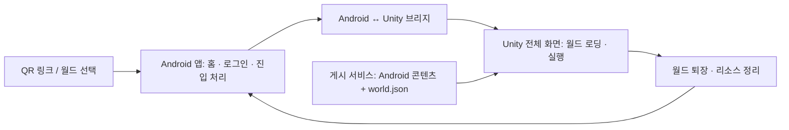

**Kimchily Android 호스트와 Unity 월드 실행 구조**

작성일: 2026-09-18. 사용자 결정: 네이티브 Android 앱을 먼저 별도 개발하고, 필요할 때 Unity 월드를 전체 화면으로 실행한다. 아래는 목표 설계다.

후속 구현: [KimchilyAndroid](../../KimchilyAndroid/README.md)와 [KimchilyUnityRuntime](../../KimchilyUnityRuntime/README.md)에 네이티브 홈, 메시지 브리지, 내장 demo 월드의 입퇴장을 구현했다. 단독 APK·Unity 포함 ARM64 IL2CPP APK 빌드, Kotlin 테스트 7개·Unity PlayMode 테스트 6개를 통과했다. Android 실기기 실행, 원격 콘텐츠·계정·QR 연결은 아직 남아 있다. 아래의 원본 World 전환 계획과 신규 실행기 구현을 구분한다.

**앱 구성**

Android 앱이 서비스의 진입점과 화면 이동을 담당하고, Unity World는 내장된 월드 실행 모듈로 사용한다. 두 프로젝트는 따로 개발하고 최종 배포 시 하나의 Android 앱으로 묶는다. Unity에서 export한 `unityLibrary` Gradle 모듈을 네이티브 앱에 포함하는 Unity as a Library 방식을 사용한다. Unity 공식 문서는 이 모듈과 기본 `launcher`를 구분하며, 자체 앱으로 launcher를 대체할 수 있다고 설명한다. [Unity Android 통합 문서](https://docs.unity3d.com/2022.3/Documentation/Manual/UnityasaLibrary-Android.html)

Unity 런타임·Kimchily SDK·선택한 스크립트 VM은 앱에 포함한다. QR 게시로 갱신할 대상은 해당 런타임이 읽을 수 있는 월드 콘텐츠·스크립트·manifest다. Unity 실행 모듈 자체를 QR로 내려받아 설치하는 구조로 정의하지 않는다.

| 담당 | 기능 |
|---|---|
| 네이티브 Android 앱 | 앱 시작, 홈·로그인·월드 목록, QR/링크 처리, 계정 상태, Unity 화면 진입 및 복귀 |
| Android–Unity 브리지 | 실행 요청 전달, 초기화 완료 대기, 요청별 진행률·완료·오류·퇴장 알림, Android 생명주기 연결 |
| Unity World 실행기 | 콘텐츠 다운로드·캐시, manifest·파일 검사, 씬·FBX·스크립트 로딩, 입력·물리·렌더링·Coroutine, 월드 리소스 정리 |
| Creator/ToolManager SDK | Unity API 래퍼·바인딩, Android용 콘텐츠 빌드, 업로드, 실행 링크·QR 표시 |
| 게시 서비스 | 월드 ID와 게시 버전 조회, 콘텐츠 저장·전달, 호환 버전 정보 |

다운로드·캐시는 Unity 실행기로 일원화하는 초기 설계다. Android는 계정과 월드 선택을 담당하며 필요한 접근 정보를 전달한다. 기존 `WorldContentSession.OpenLocal` 앞에 다운로드 계층을 추가한다. 현재 구현은 다운로드가 끝난 로컬 파일의 동기 검사·로드이므로 모바일용 비동기 처리와 진행률은 후속 구현이다. 네이티브 앱과 Unity가 같은 콘텐츠를 각각 다운로드하거나 캐시를 따로 관리하지 않도록 한다.

**별도 개발과 연결 순서**

1. 별도 네이티브 앱 프로젝트를 만든다. Kotlin을 기본 구현 후보로 두고, 앱은 `WorldLauncher` 인터페이스를 통해 월드 실행을 요청한다. 이 경계를 두면 Unity export 전에도 앱 화면과 진입 흐름을 개발할 수 있다.
2. Unity World에 작은 상주 Bootstrap 씬과 `WorldRuntime` 실행기를 구성한다. 기존 Unity 홈 화면 버튼 대신 외부 요청으로 월드를 연다. Unity 내부 로컬 테스트에서도 같은 진입 API를 호출하도록 한다.
3. Unity 프로젝트를 Android Gradle 프로젝트로 export하고 `unityLibrary`를 네이티브 앱에 연결한다. export 산출물과 직접 관리하는 Android 코드를 분리해 재export 때 변경을 잃지 않도록 한다.
4. 우선 앱 버튼 → Unity 샘플 월드 → 퇴장 → 앱 복귀 → 재입장을 검증한다. 그 뒤 원격 다운로드와 QR 링크를 연결한다.
5. Creator의 게시 버튼에서 Android용 번들과 manifest를 배포하고, QR이 네이티브 앱의 월드 진입 흐름으로 이어지도록 연결한다.

Unity 버전에 맞는 통합 예제를 사용한다. 공식 예제의 현재 기본 브랜치는 Unity 6용이며 2022 LTS용 별도 브랜치를 제공한다. 기존 검증 버전은 2022.3.16f1이고 원본 세 프로젝트는 2021.3.11f1이므로, 실제 Android 통합 전에 Unity·SDK·콘텐츠 빌드 버전을 일치시켜야 한다. 이 문서 작성으로 원본 프로젝트를 업그레이드하지 않았다. [공식 예제 버전 안내](https://github.com/Unity-Technologies/uaal-example/blob/master/docs/android.md), [2022 LTS 예제](https://github.com/Unity-Technologies/uaal-example/tree/uaal-example/22LTS)

**브리지의 초기 계약**

아래 규약의 내장 demo 입퇴장 경로를 신규 실행기에 구현했다. 재입장 초기화를 위한 Initialize와 Unity UI의 퇴장 요청을 위한 CloseRequested도 추가했다. 원격 게시 버전/계정 관련 실행 정보는 후속 구현이다. 스크립트 언어의 LuaTable/JS 객체나 Unity GameObject를 Android 경계에 노출하지 않고 직렬화 가능한 값으로 전달한다.

| 방향 | 메시지 | 의미 |
|---|---|---|
| Unity → Android | `RuntimeReady` | 브리지와 Bootstrap 초기화 완료 |
| Android → Unity | `OpenWorld` | protocolVersion, requestId, worldId, 선택한 revision 및 검증된 실행 정보 전달 |
| Unity → Android | `WorldProgress` | 해당 requestId의 다운로드·검사·씬 로딩 단계 전달 |
| Unity → Android | `WorldReady` | 씬과 스크립트 초기화가 끝나 실제 이용 가능한 상태 |
| Unity → Android | `WorldFailed` | requestId와 오류 코드, 재시도 가능한지 전달 |
| Android → Unity | `CloseWorld` | 진행 중 요청 취소 또는 실행 중 월드 퇴장 |
| Unity → Android | `WorldClosed` | 월드 정리를 마쳤으며 네이티브 화면으로 복귀 가능한 상태 |

Unity 준비 전에 들어온 실행 요청은 Android 브리지에서 보관하고 `RuntimeReady` 이후 전달한다. 기본 동작은 한 번에 한 월드이며, 로딩 중 중복 요청은 requestId로 구분한다. 다른 월드로 전환할 때는 기존 작업의 취소·종료가 끝난 뒤 다음 요청을 처리한다. Android UI 갱신과 Unity 객체 조작은 각 플랫폼의 해당 스레드로 전달해야 한다.

**퇴장과 앱 생명주기**

월드 퇴장과 Unity 런타임 종료를 구분한다. 기본 퇴장은 새 작업 차단 → 다운로드·Coroutine 취소 → 스크립트 종료 처리와 이벤트 참조 해제 → 씬·생성 객체 제거 → 번들 세션 해제 → 스크립트 VM 해제 완료 → `WorldClosed` 순서로 관리한다. 스크립트의 종료 콜백이 필요한 동안 VM을 유지한다. 현재 xLua 테스트에서 확인한 프레임 종료 후 callback 참조 정리도 실행기에 반영해야 한다.

앱의 홈 버튼·화면 잠금·백그라운드 전환은 곧바로 월드 퇴장으로 취급하지 않는다. pause/resume과 명시적 퇴장을 구분하고, 프로세스가 종료된 뒤에는 보관된 월드 ID로 새 세션을 복원한다.

Unity가 제공하는 unload는 일부 런타임 메모리를 유지하며, quit은 Unity를 실행하는 프로세스를 종료한다. 따라서 일반적인 홈 복귀에 `Application.Quit`을 사용하지 않고, 월드 정리와 런타임 보관/unload 정책을 별도로 구현·측정한다. 전체 화면과 단일 Unity 런타임을 사용하는 이번 결정은 공식 지원 범위에 맞는다. [Unity 생명주기와 제약](https://docs.unity3d.com/2022.3/Documentation/Manual/UnityasaLibrary-Android.html)

**현재 코드에서 바꿀 곳**

| 현재 파일 | 확인 사항과 전환 작업 |
|---|---|
| `UnityKimchilyWorld/Assets/Scripts/UIManager.cs` | Unity Play 버튼이 기존 로더를 직접 호출한다. 외부 `OpenWorld` 요청으로 연결하고 상태 표시를 실행기 이벤트와 분리한다. |
| `UnityKimchilyWorld/Assets/Scripts/AssetBundleLoadManager.cs` | 고정 manifest 주소·첫 번째 씬 선택·고정 번들 종류를 새 world.json 기반 실행기로 전환한다. 다운로드 취소와 재입장 수명주기가 필요하다. |
| `UnityKimchilyWorld/Assets/Scripts/AssetsContainer.cs` | 전역 리스트와 DontDestroyOnLoad 상태를 월드 세션별로 해제해야 한다. 기존 singleton 중복 처리도 재입장 전에 보완한다. |
| `KimchilySDK/Packages/com.kimchily.creator/Runtime/Content/WorldContentSession.cs` | 로컬 콘텐츠 검증과 번들 로드/해제를 재사용한다. 씬 unload 이후 Dispose하는 계약을 유지한다. |
| `KimchilySDK/Packages/com.kimchily.creator/Runtime/Coroutines/CoroutineScheduler.cs` | 월드 owner별 취소와 VM 종료 전 작업 정리에 재사용한다. |
| `UnityKimchilyWorld/Assets/Plugins/Android/libs` | xLua의 ARM64·ARMv7·x86 파일이 있다. Android x86_64 파일은 확인하지 못했다. DLL 존재만으로 IL2CPP/AOT 실행을 보장할 수 없으므로 ARM64 실기기에서 검증한다. |

최초 조사에서는 별도 Android Gradle/Kotlin 앱과 Android–Unity 브리지가 없었으며, 현재는 위 두 신규 프로젝트에 첫 구현을 추가했다. 원본 World의 AndroidTargetArchitectures 값은 ARMv7 구성이므로 ARM64 라이브러리가 있다는 것과 ARM64 Player를 빌드한다는 것을 구분해야 한다. 신규 실행기는 ARM64 IL2CPP로 빌드했다. Windows용으로 통과한 번들은 Android용으로 다시 빌드해야 하며, 실제 앱·플러그인·콘텐츠가 같은 ABI와 버전 구성을 사용해야 한다.

이전 SDK 검증 결과인 EditMode 6개·PlayMode 20개 통과는 재사용할 코어의 Windows Editor 증거다. 새 Kotlin 7개·Unity PlayMode 6개 결과와 통합 APK 빌드가 추가되었다. 기기에서 JNI 왕복·뒤로 가기·일시중지/복귀·반복 입퇴장은 아직 실행 검증하지 않았다.
