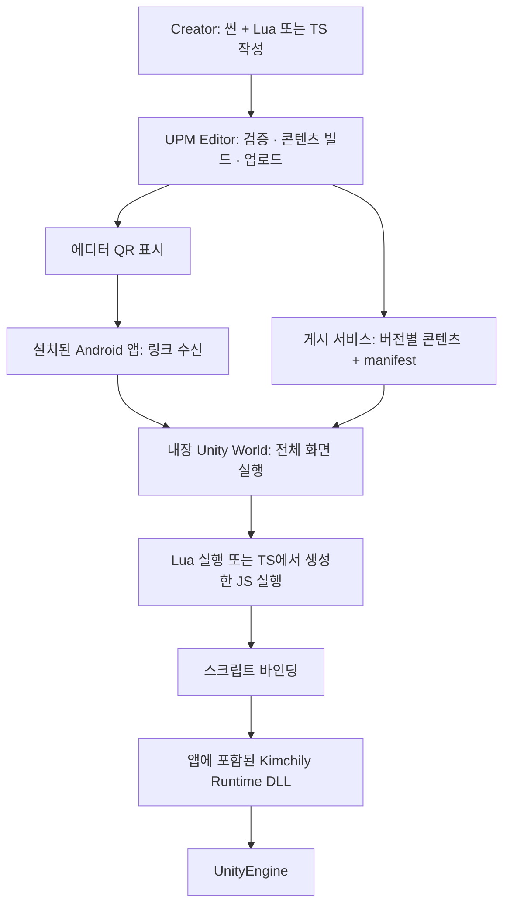

**Kimchily Creator SDK — DLL·스크립팅·UPM·QR 게시 기능 정의**

작성일: 2026-09-18  
상태: 최초 문서 작성 당시의 개발 전 기능 정의 초안. 스크립트 언어의 제품 선택은 미확정이다. 후속 결정으로 Android를 우선 대상으로 하고, 별도 네이티브 앱에서 Unity 월드를 전체 화면으로 실행한다. [Android 호스트 통합 설계](kimchily-android-host-architecture-2026-09-18.md)를 적용한다.

후속 구현: Coroutine과 씬 의존성 기반 콘텐츠 빌드의 첫 코드가 추가되었다. 최신 범위·검증 결과·남은 작업은 [KimchilySDK 구현 안내](E:/task/Unity_Project/KimchilySDK/README.md)를 참고한다. 아래 내용은 당시 정의한 전체 목표이며 QR 게시 완료를 의미하지 않는다.

**1. 이번 목표**

제작자가 Unity에서 씬과 스크립트를 작성하고, Kimchily SDK로 Unity 기능을 호출하며, 에디터의 게시 버튼을 누르면 콘텐츠가 업로드되고 QR이 표시된다. Android에서 QR을 열면 **미리 설치한 네이티브 Kimchily 앱**이 링크를 받고, 앱에 포함한 Unity 월드 실행기가 해당 콘텐츠 버전을 내려받아 전체 화면으로 실행한다. 퇴장하면 네이티브 앱으로 복귀한다.

구현 범위는 다음 여섯 가지다.

| 구성 | 완료해야 할 기능 |
|---|---|
| Runtime DLL | 지원할 Unity API와 Kimchily 기능 정의 및 래핑 |
| Script Bridge | Lua 또는 TypeScript 계열 스크립트 실행, C# 상호 호출 |
| UPM 패키지 | DLL, 네이티브 런타임, 바인딩, Editor 도구, 샘플을 버전 고정 배포 |
| Editor 게시 도구 | 검증 → 빌드 → 업로드 → 게시 완료 확인 → QR 표시 |
| 최소 게시 서비스 | 산출물 저장, 버전별 manifest, 접근 가능한 실행 링크 발급 |
| Android 호스트 + Unity World | Android의 QR 링크 수신·화면 진입/복귀, Unity의 호환성 검사·다운로드·씬/스크립트 실행·종료 |

이전 전체 서비스 리포트에 포함했던 친구·상점·정산·피드·멀티플레이는 이번 완료 조건에 넣지 않는다. 업로드 권한과 테스트 링크 관리 정도의 최소 서버 기능은 QR 게시를 위해 포함한다.

ZEPETO 공식 문서 역시 에디터 QR 테스트와 Studio 업로드 후 QR 테스트를 구분한다. 이번의 기본 목표는 **업로드 후 이용 가능한 QR 게시**로 두고, 같은 네트워크에서 PC가 직접 파일을 제공하는 로컬 QR 미리보기는 선택 기능으로 둔다. [ZEPETO 테스트 안내](https://docs.zepeto.me/world-sdk-guide/4-test-your-world)

**2. DLL이 담당하는 역할**

Unity의 Transform·Physics·Animator 엔진 구현은 UnityEngine이 제공한다. Kimchily DLL은 이 중 지원할 기능의 호출 표면, 객체 수명, 이벤트, 타입 변환, 오류 처리와 Kimchily 전용 기능을 정의한다.



권장 DLL 분리는 아래와 같다. 명칭은 제안이며 현재 파일명 변경을 수행한 것은 아니다.

| DLL | 책임 | 포함 위치 |
|---|---|---|
| Kimchily.Runtime.dll | Unity 기능 래퍼, 월드 실행 규약, 객체·리소스 수명 | Creator SDK와 World 앱 |
| Kimchily.Scripting.Lua.dll 또는 Kimchily.Scripting.JavaScript.dll | VM 연동, 함수·이벤트·타입 바인딩 | 선택한 언어용 하나를 Creator와 World에 포함 |
| Kimchily.Editor.dll | importer, 인스펙터, 바인딩·타입 정의 생성, 검증·빌드·게시 UI | Unity Editor 전용 |

외부 라이브러리 구성에 따라 브리지가 DLL 여러 개와 네이티브 플러그인으로 나뉠 수 있다. 이는 패키징 검증 단계에서 정한다.

**World 앱에는 래퍼 DLL·VM·바인딩을 미리 포함한다.** QR로 내려받을 것은 콘텐츠 번들, 스크립트, manifest다. 새로운 C# 클래스나 래퍼 API를 추가하면 SDK와 World 앱의 업데이트가 필요하다는 버전 정책을 기본으로 한다. AssetBundle에 직렬화된 객체는 담을 수 있지만 그 클래스 정의는 앱 어셈블리에 있어야 한다. [Unity AssetBundle 설명](https://docs.unity3d.com/2021.3/Documentation/Manual/AssetBundlesIntro.html)

**3. 1차로 정의할 Unity 기능**

“Unity 기본 기능”을 아래 범주와 지원할 메서드 목록으로 고정한다. Unity API 전체를 한 번에 노출하는 방식보다 샘플 월드에 필요한 기능부터 명확히 제공하는 것이 적절하다.

| 범주 | 1차 지원 기능 | 확인할 샘플 |
|---|---|---|
| 스크립트 생명주기 | Awake, OnEnable, Start, Update, FixedUpdate, LateUpdate, OnDisable, OnDestroy | 생성·활성화·비활성화·제거 이벤트 순서 |
| 객체·컴포넌트 | 참조 주입, Instantiate, Destroy, SetActive, 지원 컴포넌트 조회 | 프리팹 생성·숨김·제거 |
| 수학·Transform | Vector2/3, Quaternion, 위치·회전·크기, 부모 및 로컬/월드 좌표 | 오브젝트 이동·회전 |
| 시간·예약 | deltaTime, 경과 시간, 지연 호출 및 취소 | 프레임과 무관한 이동, 월드 종료 시 예약 해제 |
| 입력·카메라 | 키·버튼·포인터/터치, 가상 조이스틱, 화면 좌표 기반 ray | PC·모바일에서 같은 상호작용 |
| 물리 | Raycast, Collider/Trigger 이벤트, 기본 Rigidbody 조작 | 클릭 선택, 충돌·영역 진입 |
| 렌더링·애니메이션 | Renderer 표시, 제한된 재질 값, Animator 파라미터·Trigger | 버튼으로 색상·애니메이션 변경 |
| UI | Text/TMP 텍스트, Image, Button, Slider의 값·이벤트 | UI 클릭 후 숫자 증가 |
| 오디오 | AudioSource 재생·정지·볼륨 | 상호작용 시 효과음 |
| 리소스·씬 | 게시 콘텐츠 내 프리팹·이미지·오디오 로드와 해제, 지정 진입 씬 | 다운로드된 프리팹 사용, 퇴장·재입장 |
| 진단 | 로그·경고·예외, 스크립트 파일·라인, 실행 버전 표시 | 스크립트 오류 위치 확인 |

기존 플레이어 이동·카메라는 이 API 위의 샘플 또는 별도 Player 모듈로 정리한다. 복잡한 이동·점프·네트워크 캐릭터 완성도를 이 첫 QR 게시 검증과 묶지 않는다.

기능 목록 다음에는 API별로 **메서드 서명, 전달 타입, 반환값, 이벤트 해제 규칙, 오류 동작, 지원 플랫폼**을 정의해야 한다. 초기에는 임의의 generic/ref/out 호출 대신 노출된 구체 타입·메서드 집합으로 바인딩한다.

공통 규칙은 다음과 같다.

- Unity 객체 접근은 Unity 메인 스레드에서 실행한다.
- 스크립트에 필요한 인스펙터 참조를 주입한 뒤 사용자 초기화 함수를 호출한다.
- 오브젝트 파괴 후 접근, 없는 자산, 잘못된 인자를 일관된 오류로 처리한다.
- 월드 종료 시 이벤트·타이머·자산 참조·스크립트 상태를 해제한다.
- 생성된 래퍼와 자동완성 정의가 같은 API 목록·버전에서 나오게 한다.
- 지원 API 목록만 만들었다고 샌드박스가 완성되는 것은 아니다. 실제 VM의 우회 접근 및 실행 제한은 별도 검증한다.

**4. Lua와 TypeScript 결정**

현재 소스에는 xLua의 Unity 타입 바인딩 설정, KimchilyBehaviour, Lua importer가 있다. 따라서 **기존 자산을 재사용하는 첫 구현의 기본 후보는 Lua**다. 사용자가 언어를 확정한 것은 아니므로 이 문서는 선택 근거와 검증 조건을 제안한다.

| 판단 항목 | Lua/xLua | TypeScript + JavaScript 런타임 |
|---|---|---|
| 기존 코드 재사용 | 기존 브리지·importer·예제 활용 가능 | 바인딩·importer·빌드 경로 교체 또는 추가 |
| 작성 경험 | 간단한 스크립팅, 주석 기반 타입·자동완성 정의 보완 | 정적 타입 검사·자동완성·모듈 도구 활용 |
| 실행 산출물 | Lua 소스 등 선택 VM이 지원하는 형식 | 일반적으로 TS를 JS로 변환한 산출물 |
| 추가 도구 | xLua 바인딩·네이티브 패키지 정리 | 변환 도구, 타입 정의, 소스맵, JS VM·C# 브리지 |
| 모바일 검증 | IL2CPP/AOT 바인딩, 네이티브 ABI, 콜백·해제 | 선택 JS 엔진·백엔드, IL2CPP/AOT 바인딩, ABI·콜백·해제 |
| 변경 비용 | 현재 구조의 결함 복원 비용 | VM 교체 외에 스크립트 자산·예제·도구 재작성 비용 |

TypeScript를 채택한다고 “.ts 파일을 그대로 인터프리터가 실행한다”고 정의할 필요는 없다. PuerTS 같은 후보는 TS를 JavaScript로 변환하고 JS 런타임에서 실행하는 구조를 제공한다. ZEPETO의 공개 문서는 TypeScript 지원을 설명하지만, 사용자가 관찰한 내부 런타임의 세부 구현을 이번 분석에서 재검증한 것은 아니다. [PuerTS TypeScript 처리](https://puerts.github.io/en/docs/puerts/unity/knowjs/typescript/), [xLua 공식 저장소](https://github.com/Tencent/xLua), [ZEPETOScript 공식 안내](https://docs.zepeto.me/world-sdk-guide/hello-zepetoscript)

권고하는 결정 순서는 **언어와 무관한 API 목록 정의 → 동일한 작은 샘플의 Lua/TS 실행 검증 → 첫 모바일 대상에서 확인 → 한 언어를 선택하고 SDK 계약 고정**이다. 기존 Lua가 복원 가능하고 제작자의 TS 선호가 결정적이지 않다면 Lua가 이관 작업을 줄일 수 있다. TS 제작자 경험이 주요 요구라면 SDK 외부 배포 전에 TS를 선택하는 편이 전환 비용을 줄인다.

검증 샘플은 “오브젝트 이동 + 버튼 클릭 + 트리거 콜백 + 프리팹 로드 + 오류 위치 표시 + 퇴장 후 재실행”으로 맞춘다. 바인딩 호출 비용·할당·초기화 시간을 같은 기기에서 측정하고, 언어 이름만으로 성능 우열을 단정하지 않는다. 첫 구현에서 두 언어의 완성 지원을 동시에 목표로 삼지 않는다.

Runtime의 기능 API와 언어 브리지의 경계를 분리하면 재사용 범위가 늘어난다. 그래도 언어를 바꿀 때 사용자 스크립트와 관련 메타데이터·도구를 자동으로 그대로 사용할 수 있는 것은 아니다.

**5. UPM 배포 형식과 Editor 버튼**

권장 패키지 형상의 예시는 다음과 같다. 하나의 패키지 안에서 Runtime/Editor를 명확히 나누는 것으로 시작할 수 있다.

```text
com.kimchily.creator/
  package.json
  Runtime/
    Plugins/             Runtime DLL·브리지·플랫폼별 네이티브 플러그인
    Resources/           필요한 기본 리소스
  Editor/
    Plugins/             Editor 전용 DLL
    Templates/           스크립트·월드 템플릿
  Samples~/
    BasicWorld/
  Documentation~/
```

DLL PluginImporter 설정에서 Editor와 대상 플랫폼을 명시한다. 패키지를 배포하기 전에는 원본 소스 프로젝트와 별도의 소비 프로젝트에서 설치·컴파일·실행을 검증해야 한다. 같은 타입을 소스와 DLL로 동시에 포함하지 않는다.

기존 `kimchily.creator.tool` 패키지 및 GUID를 새 이름으로 이동할 경우 참조 마이그레이션을 계획한다. 위 이름으로 곧바로 바꾸라는 의미는 아니다.

Unity 에디터 안의 메뉴·버튼은 구현 가능하다. 첫 버전은 `Kimchily > Creator` 메뉴에서 도킹 가능한 Creator 창을 열고, 창 상단에 버튼을 배치하는 방식을 권고한다. Unity의 공식 `MenuItem`과 `EditorWindow` API로 구현할 수 있다. [MenuItem](https://docs.unity3d.com/2021.3/Documentation/ScriptReference/MenuItem.html), [EditorWindow](https://docs.unity3d.com/2021.3/Documentation/ScriptReference/EditorWindow.html)

버튼과 사용자가 확인할 정보:

| UI | 동작 |
|---|---|
| 월드 이름·시작 씬·대상 플랫폼 | 게시할 콘텐츠 지정 |
| 검사 | 누락 참조·지원하지 않는 컴포넌트·스크립트 오류·자산 의존성 확인 |
| 에디터 실행 | 같은 Runtime API로 로컬 실행 |
| 게시 및 QR | 검사·빌드·업로드·게시 확인 후 QR 표시 |
| QR 창 | 버전·플랫폼·만료 시각·QR·링크 복사 |
| 진행/오류 표시 | 현재 단계, 취소, 실패 원인과 재시도 |
| 로컬 QR 미리보기 | 선택 기능. 같은 네트워크에서 PC가 콘텐츠를 제공 |

기존 Play 버튼 바로 옆의 메인 툴바 배치가 필요하면 별도의 UI 요구로 잡는다. 1차 게시 기능은 공식 EditorWindow 안의 버튼으로 완성하고, 메인 툴바의 버전별 확장 방식은 이후 검증한다.

**6. QR 게시와 World 앱 실행 규약**

QR은 콘텐츠 자체를 담기보다 **특정 게시 버전으로 진입하는 링크**를 담는다. 이 설계에서는 같은 QR이 가리키는 revision을 고정해 테스트 도중 콘텐츠가 조용히 바뀌지 않게 한다.

기본 처리 순서:

1. Editor가 선택한 시작 씬·의존 자산·스크립트를 검사한다.
2. TS 선택 시 타입 검사·JS 변환을 수행한다. Lua 선택 시 구문·모듈 참조를 검사한다.
3. 선택 플랫폼용 AssetBundle과 스크립트 산출물, 버전별 manifest를 생성한다.
4. 게시 서비스에 업로드하고 파일 존재·크기·hash와 게시 완료 상태를 확인한다.
5. 게시 서비스가 실행 링크를 반환하면 Editor가 QR을 표시한다.
6. 휴대폰에서 링크를 열어 World 앱으로 진입한다.
7. 앱은 manifest의 플랫폼·SDK·스크립트 런타임 호환성을 확인한다.
8. 콘텐츠를 다운로드·검증하고 지정 씬과 스크립트를 실행한다.
9. 월드 종료 시 자원을 해제하고 다음 QR을 받을 수 있는 상태로 복귀한다.

실행 링크 예시는 `https://<게시도메인>/play/<공유코드>`다. 서버가 공유코드와 worldId/revisionId를 연결한다. 비공개 테스트라면 만료·폐기 가능한 테스트 권한을 적용하고 업로드용 비밀정보를 QR에 넣지 않는다.

World 앱이 설치되어 있으면 앱으로 열고, 미설치 상태라면 설치 안내를 제공하는 연결이 필요하다. OS별 App/Universal Link 설정과 Unity의 최초 실행 URL·실행 중 URL 수신을 모두 처리한다. URL을 인식했다고 자동으로 임의 코드나 DLL을 실행하게 하지 않고 게시된 manifest를 조회한다. [Unity 딥링크 이벤트](https://docs.unity3d.com/2021.3/Documentation/ScriptReference/Application-deepLinkActivated.html)

최소 manifest 제안:

| 필드 | 역할 |
|---|---|
| schemaVersion | manifest 형식 |
| worldId, revisionId | 게시 콘텐츠와 불변 버전 |
| platform | 대상 플랫폼 |
| sdkVersion, minimumPlayerVersion | SDK·앱 호환성 |
| scriptLanguage, scriptRuntimeVersion | 실행 언어와 런타임 호환성 |
| entryScene, scriptEntry | 명시적인 진입점 |
| files 및 dependencies | 파일 URL·크기·hash·적재 관계 |

서버 API는 우선 “업로드 시작/파일 전송/게시 완료/실행 링크 조회/manifest 조회” 정도면 된다. 파일 저장소와 작은 메타데이터 서비스로 시작할 수 있으며, 전체 소셜 플랫폼 서버를 선행 개발할 필요는 없다.

게시 실패 시 QR을 성공 결과로 표시하지 않는다. 모바일에서 오류가 발생하면 SDK 버전 불일치, 만료, 네트워크, 번들, 스크립트 중 어느 단계인지 사용자와 제작자가 구분할 수 있게 한다.

**7. 기존 코드와의 연결 및 개발 순서**

| 기존 자산 | 활용 방향 |
|---|---|
| KimchilyGenConfig의 LuaCallCSharp/CSharpCallLua 목록 | 지원 API 및 바인딩 목록의 출발점 |
| KimchilyBehaviour | lifecycle·이벤트 브리지의 기반; 초기화·해제·월드 수명 개선 |
| LuaScriptedImporter 및 RefGameObjects | 스크립트 자산화·인스펙터 참조 연결 |
| AssetBundleBuildManager의 Kimchily/Build | 게시 파이프라인의 콘텐츠 빌드 단계로 분리 |
| World AssetBundleLoadManager | 고정 URL 대신 QR로 받은 worldId/revision manifest를 로드 |
| 기존 Creator 씬 | API와 게시 경로를 검증할 BasicWorld로 정리 |

현재 구현 근거: [Unity 타입 바인딩](<E:/task/Unity_Project/UnityToolManager/Assets/XLua/Src/KimchilyGenConfig.cs:17>), [Lua 브리지](<E:/task/Unity_Project/UnityToolManager/Assets/KimchilyFrameWork/KimchilyBehaviour.cs:23>), [기존 Editor 빌드 메뉴](<E:/task/Unity_Project/UnityToolManager/DLL Projects/CreatorEditFramework/CreatorEditFramework/AssetbundleBuild/AssetBundleBuildManager.cs:13>), [World 로더](<E:/task/Unity_Project/UnityKimchilyWorld/Assets/Scripts/AssetBundleLoadManager.cs:110>).

실제 개발 순서와 완료 판정은 아래와 같이 잡는다.

| 순서 | 작업 | 완료 판정 |
|---|---|---|
| 1 | 기존 SDK 복원 및 API 명세 | 샘플에 필요한 타입·메서드·이벤트·오류 규칙 확정 |
| 2 | 언어 검증 및 선택 | 같은 샘플을 첫 대상 모바일 환경에서 실행하고 언어 결정 |
| 3 | DLL·UPM 정리 | 빈 Unity 프로젝트에 패키지를 설치해 샘플 실행 |
| 4 | 콘텐츠 빌더·manifest | Play 없이 새 환경에서도 재현 가능한 산출물 생성 |
| 5 | Editor 게시 창·최소 게시 서비스 | 버튼 한 번으로 업로드 완료와 QR 표시 |
| 6 | World 딥링크·다운로드·실행 | QR을 열어 PC의 Unity를 종료한 뒤에도 업로드된 월드 실행 |
| 7 | 실패·종료·반복 검증 | 만료·불일치·다운로드 실패를 처리하고 다른 QR 재입장 성공 |

**이 범위의 최종 완료 기준은 “새 Creator 프로젝트에서 SDK 설치 → 스크립트로 Unity 기능 사용 → Editor 게시 버튼 → QR 스캔 → World 앱에서 같은 결과 확인”이다.**

첫 대상 플랫폼, 외부 네트워크 게시 주소, 스크립트 언어의 최종 선택은 구현 착수 시 고정한다. 현재 문서는 DLL/UPM/API 설계를 논의하는 단계이므로 특정 언어나 서버 제공자를 이미 결정한 것으로 취급하지 않는다.
