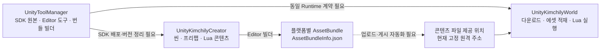

**Kimchily 3개 프로젝트 분석 및 독립 서비스 확장 리포트**

작성일: 2026-09-18  
대상: `UnityKimchilyCreator`, `UnityKimchilyWorld`, `UnityToolManager`  
목표: 사용자가 확인한 **ZEPETO와 유사한 독립 서비스 구축**  
기준 경로: `E:/task/Unity_Project`

**후속 범위 확정:** 사용자는 우선 목표를 Unity 기능 래핑 DLL·Lua/TS 스크립팅·UPM 패키지·Unity Editor 버튼·QR 게시 및 World 앱 실행으로 좁혔다. 착수 범위는 [Creator SDK·QR 기능 정의서](E:/task/Unity_Project/docs/reports/kimchily-creator-sdk-qr-scope-2026-09-18.md)를 따른다. 아래 전체 플랫폼 로드맵은 장기 참고이며 계정·경제·소셜 전반을 첫 단계의 필수 작업으로 보지 않는다.

이 리포트는 소스, Unity 설정, 씬·프리팹 직렬화 정보, 패키지 선언, DLL 해시를 분석한 결과다. ZEPETO의 비교 범위는 공식 공개 자료를 기준으로 정했다. 코드·설정·에셋은 수정하지 않았으며 Unity 실행, DLL 재빌드, 실제 기기 테스트, 기존 원격 콘텐츠 URL 접속은 수행하지 않았다. 따라서 “구현 코드가 있음”과 “실행 검증을 통과함”을 구분한다.

분석 대상에서 서버 구현을 찾지 못했다는 설명은 **이 세 폴더 안에서의 관찰**이다. 다른 폴더나 별도 저장소의 서버 존재 여부까지 판단한 것은 아니다. 세 폴더는 현재 위치에서 Git 저장소로 인식되지 않아 변경 이력·기준 커밋을 확인할 수 없었다.

---

**1. 핵심 판단**

**세 프로젝트는 확장에 활용할 수 있다. 현재 단계는 Lua로 제작한 콘텐츠를 AssetBundle로 전달하고 실행하는 기술 검증용 기반이며, 독립 소셜·아바타 플랫폼을 운영할 서비스 계층은 새로 구축해야 한다.**

재사용 가치가 가장 큰 부분은 ToolManager의 Lua/C# 연결 및 제작 도구 소스다. Creator는 제작자 프로젝트 템플릿으로, World는 이용자용 실행 클라이언트로 발전시키는 것이 자연스럽다.

우선순위는 **SDK와 콘텐츠 계약 정리 → 제작·게시·실행 흐름 복원 → 계정·아바타·멀티플레이 → UGC 운영 → 경제·소셜 확대**다. 현재 불일치를 남겨두고 기능을 추가하면 제작 환경에서는 동작하지만 이용자 앱에서는 실패하는 문제가 누적될 가능성이 높다.

ZEPETO 공식 자료는 Unity 제작 도구뿐 아니라 아바타·소셜 API, 멀티플레이와 데이터 저장, 수익화, 테스트·통계를 함께 설명한다. 독립 서비스를 만들려면 이 연결 기능의 서버·운영 책임도 직접 마련해야 한다. [ZEPETO World SDK 개요](https://docs.zepeto.me/world-sdk-guide)

---

**2. 폴더별 역할과 현재 수준**

| 폴더 | 실제 역할 | 확인한 구현 | 확장 시 역할 |
|---|---|---|---|
| UnityKimchilyCreator | SDK를 이용하는 콘텐츠·Lua 샘플 프로젝트 | 오피스 프리팹·씬, Lua 호출/텍스트 변경 예제 | 제작자용 프로젝트 템플릿, 샘플 월드 |
| UnityKimchilyWorld | 번들을 내려받아 실행하는 이용자 앱의 초기 형태 | 원격 JSON 조회, 플랫폼 선택, 최대 4개 동시 다운로드, 에셋 적재, Lua 경로 등록, 씬 진입 | 로그인·월드 탐색·아바타·방 입장이 있는 이용자 클라이언트 |
| UnityToolManager | SDK 원본 개발 및 배포본 관리 프로젝트 | Lua importer/inspector, Lua lifecycle 연결, 플레이어·카메라·입력, 번들 빌더, 별도 DLL 프로젝트 | 공통 SDK, 제작 도구, 빌드·검증 도구의 기준 소스 |

이름만 보면 ToolManager를 계정·콘텐츠 관리 콘솔로 오해할 수 있지만, 현재 확인된 구현은 **Unity 제작 프레임워크 개발 프로젝트**에 가깝다. 서비스 운영자용 관리 화면은 별도 개발 범위다.

세 프로젝트 모두 Unity **2021.3.11f1**이다. CreatorTool의 패키지 선언 버전은 **0.0.1**이다. 이 정보만으로 각 DLL이 동일 빌드라는 보장은 없다.

| 조사 항목 | Creator | World | ToolManager |
|---|---|---|---|
| 프로젝트 C# 규모 | Assets 내 0개 | 자체 Assets/Scripts 4개, 약 620줄 | 자체 프레임워크·에디터 소스와 DLL 프로젝트 2개 |
| 외부 코드와 구분 | C# SDK 자체가 없음 | 총 C# 12개 중 나머지 8개는 조이스틱·에셋 보조 코드 | xLua·생성 코드·복제 소스가 포함되어 전체 파일 수를 자체 구현량으로 보기 어려움 |
| 콘텐츠/씬 | Lua 5개, 씬 3개, 프리팹 14개 | 앱 빌드 씬 Start/Patch 2개, 예제 씬 별도 | 플레이어 및 Lua 기능 검증용 샘플 |
| 핵심 의존성 상태 | Kimchily/xLua 패키지 선언 및 구현 누락 | SDK DLL을 Assets 아래에 복사 | Assets 원본, DLL 원본, 배포 패키지가 병존 |
| 자동 검증 | 자체 회귀 테스트·CI 확인 못함 | 자체 회귀 테스트·CI 확인 못함 | 검증 예제는 있으나 서비스 회귀 테스트·CI 확인 못함 |

Unity Test Framework가 manifest에 포함된 사실만으로 자동 테스트가 구현됐다고 판단하지 않았다.

---

**3. 현재 연결 구조**

아래는 소스가 의도하는 흐름이다. 전체 경로가 실제로 성공하는지는 아직 검증하지 않았으며, 현재 파일 간에 연결을 막는 누락·불일치가 있다.



World의 실제 코드 흐름은 `Play 버튼 → JSON 조회 → 플랫폼 목록 선택 → Patch 화면 → 번들 다운로드 → 에셋 등록 → Lua require 경로 등록 → 첫 번째 월드 씬 로드`다. 월드 검색·목록·방 선택 없이 고정 콘텐츠에 진입한다. [World 로더][W-loader]

현재 공통 데이터 형식은 다음 정도다.

```json
{
  "assetBundlePlatformInfoList": [
    {
      "targetPlatform": "WINDOW",
      "assetBundleInfoList": [
        {
          "filename": "scenebundle",
          "version": "1000",
          "url": "..."
        }
      ]
    }
  ]
}
```

플랫폼 문자열은 `WINDOW / MAC / AOS / IOS`, 번들 이름은 `luabundle / meshbundle / materialbundle / fbxbundle / animatorcontrollerbundle / prefabbundle / scenebundle`로 코드에 고정되어 있다.

이 계약에는 월드 ID, 제작자 ID, 명시적 진입 씬, SDK 호환 버전, 실제 의존성, 무결성 정보가 없다. 플랫폼별 번들 목록은 있지만 서비스용 콘텐츠 카탈로그는 없는 상태다.

---

**4. 각 프로젝트에서 유지할 부분과 바꿀 부분**

**Creator**

유지할 부분은 샘플 씬, 오피스 콘텐츠, Lua lifecycle 예제와 객체 주입 방식이다. 제작자에게 배포할 시작 프로젝트의 재료로 활용할 수 있다.

현재 Creator에는 C# 및 DLL 구현이 없으며 `Packages/manifest.json`에도 Kimchily SDK·xLua가 선언되어 있지 않다. 그런데 씬은 KimchilyBaseFramework DLL의 GUID를 참조한다. 일부 플레이어 프리팹·Animator·Lua 참조는 Creator에 없고 World 안의 샘플 자산에서 찾을 수 있었다. [패키지 선언][C-manifest], [Test 씬][C-scene]

따라서 SDK 설치 방식과 샘플 자산의 소유 위치를 먼저 확정해야 한다. 기존 `.meta` GUID를 보존하거나 마이그레이션해야 하며, DLL 복사만으로 복구가 끝난다고 볼 수 없다.

Lua 샘플도 상태가 다르다. `KimchilyTextTest.lua`는 실제 텍스트 변경 예제지만, `KimchilyMovement.lua`의 이동 호출은 주석 처리되어 있다. `LuaCallLua.lua`가 요구하는 `LuaScripts/LuaKYC2` 모듈은 프로젝트에 없다. [텍스트 예제][C-text], [이동 예제][C-movement], [require 예제][C-require]

Build Settings의 씬 목록은 비어 있다. 이는 애플리케이션 빌드의 씬 설정이 없다는 의미이며, 활성 씬을 대상으로 하는 별도 AssetBundle 빌드까지 불가능하다는 뜻은 아니다. Lua 번들 라벨도 저장 상태에서는 비어 있으므로 빌더를 통한 라벨 생성까지 검증해야 한다. [Build Settings][C-build]

**World**

다운로드·씬 적재의 기본 구조는 재사용할 수 있다. 다만 `AssetBundleLoadManager`가 manifest 조회, 다운로드, UI, 플랫폼 판별, 에셋 등록, 씬 이동을 함께 담당해 실패 처리와 월드 전환을 확장하기 어렵다.

다음 책임을 분리하는 것이 적절하다.

| 책임 | 필요한 동작 |
|---|---|
| 앱 흐름 | 초기화, 로그인, 로비, 입장, 실패, 복귀 상태 관리 |
| 콘텐츠 전달 | manifest 검증, 다운로드, 재시도, 취소, 캐시, 무결성 확인 |
| 월드 실행 | 의존성 적재, 진입 씬 선택, Lua 초기화·종료, 퇴장 시 해제 |
| 월드 세션 | 방 입장, 서버 연결, 재접속, 퇴장 |
| 아바타·소셜 | 외형/장착 정보, 다른 사용자 표시, 채팅·신고·차단 |

현재 `UnityEngine.Networking` 사용은 HTTP 파일 다운로드다. 멀티플레이 구현으로 계산해서는 안 된다.

로컬 실행 경로도 원격 실행과 일치하지 않는다. `StreamingAssets`에는 번들이 없으며 해당 로더는 원격 경로에 있는 Lua require 초기화를 생략한다(`AssetBundleLoadManager.cs:208`, `:296`). 플랫폼 판별의 기본값은 Windows이므로 macOS Editor·Linux·WebGL도 별도 분기 없이 Windows로 처리된다(`:389`). 향후 지원 플랫폼을 정할 때 함께 수정·검증해야 한다.

**ToolManager**

가장 중요한 확장 기반이다. `KimchilyBehaviour`는 Unity의 생명주기 및 충돌 이벤트를 Lua 함수로 연결하고, `LuaScriptedImporter`는 Lua 파일을 `LuaScriptAsset`으로 만든다. 입력·카메라·조이스틱과 기본 플레이어 조작도 있다. [Lua 실행 기반][M-behaviour], [Lua importer][M-importer], [플레이어][M-player]

하지만 기본 이동을 서비스급 아바타 시스템으로 평가할 수는 없다. 플레이어 상태의 JUMP는 미사용으로 표시되며, 이동은 Transform 직접 변경을 포함한다. 충돌·중력·점프·네트워크 권한을 포함한 컨트롤러 검증이 필요하다. 외형 파츠 자산의 존재도 사용자별 의상 장착·저장·보유권 구현과는 구분해야 한다.

권장 구조는 하나의 SDK 소스 아래에 Runtime, Editor, Samples, Tests를 나누고 각 소비 프로젝트가 같은 버전을 참조하도록 하는 것이다. 기존 DLL을 유지할지 UPM 소스로 배포할지는 선택할 수 있지만, **원본 하나에서 재현 가능한 배포물을 생성하는 원칙**은 먼저 확정해야 한다.

추가로 Editor의 Lua require 경로 생성은 `HeaderLuaManager`의 Play 진입 콜백에 의존하고, importer와 번들 빌더는 같은 초기화를 수행하지 않는다. 따라서 Play 없이 처음 빌드한 콘텐츠의 require가 정상인지 확인해야 한다. World 원격 로더가 경로를 다시 구성하는 동작과 구분해, 제작 미리보기와 모든 실행 경로의 정합성을 검증할 항목이다.

---

**5. 개발 착수 전에 처리할 문제**

P0는 재현 가능한 기반 복원에 필요한 항목, P1은 외부 사용자의 콘텐츠·서비스 공개 전에 필요한 항목, P2는 기능 확대에 따라 처리할 항목이다. 발생 조건이 다른 문제를 모두 “현재 앱이 실행 불가”로 해석해서는 안 된다.

| 우선순위 | 확인한 사실 | 영향 및 조치 |
|---|---|---|
| P0 | Creator의 SDK 선언·구현 누락, 일부 이전 GUID 해소 불가 | 패키지 버전·샘플 에셋·Importer 참조를 복원하고 새 환경에서 재임포트 검증 |
| P0 | World·ToolManager 배포본·DLL Release 출력물의 해시가 서로 다름 | 기준 SDK를 정하고 동일 소스로 재빌드. 해시 차이만으로 비호환을 확정하지는 않음 |
| P0 | World의 로컬 JSON은 평면 목록인데 로더는 플랫폼별 목록을 요구 | 스키마 통일·마이그레이션·오류 메시지 구현 |
| P0 | 로더가 목록의 null 검사보다 먼저 `.Length`를 접근 | 구형/불완전 JSON에서 예외 발생 경로 수정. 기본 원격 모드에서도 잘못된 입력에 대비 |
| P0 | ToolManager 생성 manifest의 URL 상수가 모두 빈 문자열이고 version은 고정 1000 | 실제 저장소 업로드 결과와 버전을 manifest에 연결 |
| P0 | 번들 빌더가 각 BuildAssetBundles 반환값을 검사하지 않고 완료 안내 | 실패 시 게시 중단, 부분 산출물 처리, 라벨 원복을 보장 |
| P0 | ToolManager 배포 패키지에 Android/iOS 네이티브 라이브러리는 .meta만 존재 | 모바일 대상 SDK 패키지의 실파일 복원. World에는 실파일이 있으나 상호 호환성은 별도 검증 |
| P0 | Editor 코드가 일반 Assets 경로에 있고 런타임 플레이어도 UnityEditor를 참조 | Editor/Runtime 어셈블리 분리 및 플레이어·DLL 컴파일 확인 |
| P1 | World가 요청 성공 확인 전에 JSON을 읽고, 번들은 완료 여부만으로 성공 처리 | HTTP 오류·손상 파일·타임아웃에 대한 상태 전이, 재시도·취소·오류 UI 구현 |
| P1 | version을 읽지만 캐시/업데이트 판정에 사용하지 않음 | revision·hash·SDK 호환 검증, 실패 버전 차단·이전 버전 복귀 |
| P1 | 번들과 에셋 목록이 추가만 되고 퇴장 시 해제되지 않음 | 반복 입장·월드 교체 시 중복 키·메모리·Lua 상태 누적 해소 |
| P1 | 세 Singleton이 중복 객체를 Destroy한 뒤 그 객체로 instance를 덮어씀 | 중복 인스턴스 처리와 앱/씬 수명 관리 수정 |
| P1 | 공유 LuaEnv가 전역을 상속하고 Lua 소스를 직접 실행 | 외부 UGC용 API 권한 제한, 실행량 제한, 월드별 상태 격리 설계 |
| P2 | 첫 씬 선택·에셋 종류·로드 순서를 하드코딩 | 명시적 진입 씬, 의존성 기반 적재, 콘텐츠별 수명 관리로 확장 |

직접적인 코드 근거: [로컬 JSON][W-json], [null 검사][W-null], [다운로드 처리][W-download], [World 에셋 보관][W-container], [Singleton][W-singleton], [배포 URL·버전][M-manifest], [번들 빌더][M-builder], [Editor 참조][M-player], [Lua 전역·실행][M-behaviour].

World의 Start 씬에도 세 폴더에서 정의를 찾지 못한 스크립트 GUID가 있다. World에 있는 Lua 에셋의 importer는 ToolManager의 Editor DLL을 가리키지만 그 DLL은 World에 포함되어 있지 않다. 새 환경에서의 Missing Script 및 Lua 재임포트 검증 목록에 넣어야 한다. 이것만으로 원격 번들 실행 전체의 실패를 확정할 수는 없다. [Start 씬][W-start], [World Lua 메타데이터][W-lua-meta]

**DLL 비교 실측**

| 파일 위치 | 크기 | SHA-256 앞 16자리 |
|---|---:|---|
| World/Assets/KimchilyCreatorTool/Runtime/KimchilyBaseFramework.dll | 422,912 bytes | D475BFCBBC71C860 |
| ToolManager/KimchilyCreatorTool/Runtime/KimchilyBaseFramework.dll | 382,976 bytes | 6B43D9B1E9BE67F |
| ToolManager/DLL Projects/.../bin/Release/netstandard2.1/KimchilyBaseFramework.dll | 392,192 bytes | 0045A1B982C4BE7E |
| ToolManager/KimchilyCreatorTool/Runtime/CreatorEditFramework.dll | 9,728 bytes | 526574105305F017 |
| ToolManager/DLL Projects/.../bin/Release/netstandard2.1/CreatorEditFramework.dll | 16,384 bytes | 972181D1A908F2CBB |

반면 표본 비교한 Assets 원본과 DLL 프로젝트 원본의 `KimchilyBehaviour.cs`, `KimchilyPlayerController.cs`는 각각 내용 해시가 같았다. 문제는 모든 소스가 다르다는 것이 아니라, **어떤 소스·설정에서 어떤 배포 DLL을 만들었는지 추적할 체계가 없다는 점**이다.

---

**6. ZEPETO와 비교한 기능 차이**

비교는 기능 범주 기준이다. ZEPETO 내부 아키텍처를 추정한 표가 아니며, 아래의 “추가 개발”은 독립 서비스에 대한 설계 판단이다.

| 기능 영역 | ZEPETO 공개 기능의 비교 기준 | 현재 세 폴더 | 독립 서비스에 필요한 확장 |
|---|---|---|---|
| 월드 제작 | Unity 기반 제작 SDK | Lua·씬·프리팹 기반 초기 도구 | 템플릿, 문서, API, 누락 참조·성능 검사 |
| 미리보기·배포 | 테스트, 빌드·게시, 프로파일러 | 샘플 씬과 로컬 번들 빌더 | 기기 미리보기, 게시 파이프라인, 실패 진단 |
| 콘텐츠 등록·심사 | 콘텐츠 검토 후 공개 | 구현 확인 못함 | Draft/Review/Published 상태, 검수·중단·복구 |
| 계정·프로필 | 플랫폼 사용자와 아바타 연계 | 구현 확인 못함 | 인증, 프로필, 제작자 권한, 세션 관리 |
| 아바타 | 개인 아바타를 월드에서 사용 | 기본 캐릭터 자산·조작 | 공통 리그·파츠 규격, 외형 저장, 장착·보유권 |
| 월드 탐색 | 이용자가 여러 월드에 방문 | 고정 주소·첫 씬 진입 | 카탈로그, 검색·태그, 상세, 즐겨찾기 |
| 멀티플레이 | 방·플레이어·상태·메시지 | 구현 확인 못함 | 방 서버, 입퇴장, 동기화, 재접속, 권한 검증 |
| 데이터 저장 | 플레이 데이터 저장 API | 메모리 목록 위주 | 사용자·월드별 저장, 버전·접근권한 |
| 소셜 | 팔로우, DM, 제스처, 음성 등 | 구현 확인 못함 | 관계, 채팅, 초대, 차단·신고, 음성 |
| 아이템·경제 | 제작 아이템 판매, 월드 수익화 | 구현 확인 못함 | 카탈로그·인벤토리·거래 원장·결제 검증·정산 |
| 운영·통계 | 월드 통계, 신고·모니터링 | Debug.Log 중심 | 입장/오류/이탈 지표, 검수 콘솔, 운영 기록 |
| 피드·미디어·라이브 | 콘텐츠 게시와 Live 등 | 구현 확인 못함 | 미디어 처리·피드·방송은 별도 후속 제품 범위 |

제작·테스트 기준은 [World SDK Editor Interface](https://docs.zepeto.me/world-sdk-guide/world-sdk-editor-interface), 멀티플레이 기준은 [Multiplay](https://docs.zepeto.me/world-sdk-guide/multiplay), 사용자·소셜·저장·수익화 기준은 [SDK 개요](https://docs.zepeto.me/world-sdk-guide)를 참고했다. 제작 아이템의 등록·심사는 [공식 등록 안내](https://support.zepeto.me/hc/en-us/articles/360048803033--Studio-Item-How-can-I-register-an-item-I-created), 신고·차단과 피드·라이브 운영 범주는 [공식 커뮤니티 운영 안내](https://support.zepeto.me/hc/en-us/articles/900005914226-Keeping-our-ZEPETO-community-safe), Live 등 제작 범주는 [ZEPETO Studio](https://studio.zepeto.me/)를 확인했다.

세 폴더의 기능을 확장하는 작업과 새로운 플랫폼 서비스를 만드는 작업을 별도 개발 항목으로 관리해야 한다. 현재 상태에 “ZEPETO 대비 몇 % 완성” 같은 수치를 부여할 근거는 없다.

---

**7. 권장하는 목표 구조**

아래는 현재 코드를 바탕으로 한 제안이다. 이번 분석에서 구현하거나 특정 클라우드·네트워크 제품을 확정한 내용은 아니다.

| 구성 요소 | 책임 | 현재 자산과의 관계 |
|---|---|---|
| Creator 프로젝트 | 제작자의 씬·Lua·에셋 작업 공간 | 기존 Creator를 정상화해 템플릿으로 유지 |
| Kimchily Runtime SDK | 콘텐츠 API, Lua 실행, 플레이어·리소스·서비스 연결 | ToolManager 원본에서 단일 버전으로 배포 |
| Kimchily Editor SDK | importer, inspector, 사전 검사, 미리보기, 게시 요청 | ToolManager Editor 코드 확장 |
| World Client | 로그인, 월드 탐색, 콘텐츠 실행, 아바타, 세션 UI | 기존 World를 계층별로 분리 |
| Platform API | 계정, 월드 카탈로그, 프로필, 저장, 소셜, 권한 | 새 서비스 계층 |
| Realtime Server | 방 수명, 접속, 상태 동기화, 게임 규칙·권한 | 새 서버 계층 |
| Build/Publish Worker | 검증, 플랫폼별 빌드, 산출물 등록, 게시 이력 | 기존 번들 빌더를 자동화 작업으로 발전 |
| Object Storage/CDN | 버전별 콘텐츠 전달 | 고정 Google Drive 주소의 책임 대체 |
| Admin/Creator Portal | 제작자 등록·배포 상태, 심사, 신고 처리, 통계 | 새 웹 서비스 |

초기 Platform API는 계정·월드·아이템·운영 기능을 모듈로 나눈 하나의 배포 단위로 시작할 수 있다. 실시간 방 서버와 콘텐츠 빌드 작업은 수명·자원 사용 특성이 달라 별도 프로세스로 두는 편이 적절하다. 실제 분리 수준은 목표 동시접속과 팀 규모를 확인한 뒤 결정한다.

SDK에는 `WorldContext`, `Player`, `Networking`, `Storage`, `Social`, `Economy`, `Diagnostics` 같은 서비스 경계를 마련할 수 있다. Lua 콘텐츠는 이 제한된 API를 이용하고, 인증 토큰·DB·결제 비밀정보를 직접 다루지 않게 설계한다. 재화·보유권·중요 결과 판정은 서버가 확인하도록 한다.

기본 데이터 모델도 먼저 합의해야 한다.

| 모델 | 먼저 정할 식별자·관계 |
|---|---|
| 사용자/제작자 | userId, creatorId, 역할·권한 |
| 월드/버전 | worldId, revisionId, ownerId, 공개 상태 |
| 콘텐츠 산출물 | artifactId, 플랫폼, SDK/스키마 버전, hash |
| 아바타/아이템 | avatarId, itemId, 슬롯·리그 호환, 사용자 보유권 |
| 방/참가자 | roomId, sessionId, userId, 접속·재접속 상태 |
| 운영 | reviewId, reportId, 처리 상태·기록 |
| 경제 | transactionId, 중복 처리 방지 키, 원장 항목 |

이 ID들이 있어야 동일한 아바타·보유 아이템을 여러 월드에서 일관되게 사용할 수 있다.

---

**8. 콘텐츠 계약과 UGC 실행 방식**

첫 공통 규격은 다음 필드를 포함하는 버전 지정 manifest로 권고한다.

| 범주 | 필드 예시 | 목적 |
|---|---|---|
| 식별 | schemaVersion, worldId, revisionId | 콘텐츠·버전의 명확한 구분 |
| 호환 | unityVersion, sdkVersion, minimumClientVersion, platform | 읽을 수 없는 콘텐츠 차단 |
| 진입 | entryScene, luaEntry | 첫 씬 순서에 의존하지 않는 진입 |
| 파일 | logicalName, url, sizeBytes, hash, dependencies | 다운로드·검증·적재 계획 |
| 신뢰 | 승인된 manifest에 대한 signature 또는 서버 검증 | 승인된 배포물인지 확인 |
| 게시 | 상태·작성자·게시 시각 | 서버의 공개·권한 정책과 연결 |

콘텐츠 hash는 파일 동일성을 검증하는 수단이며, 제작자 권한이나 안전한 Lua 실행을 대신하지 않는다. 인증된 게시 절차·승인 상태와 런타임 제한을 각각 구현해야 한다.

UGC는 우선 내부 제작자 또는 승인된 제작자만 게시할 수 있는 단계로 시작하는 것을 권고한다. 외부 스크립트 공개 전에는 허용 API, 파일·네트워크 접근 범위, 실행시간·메모리·오브젝트 생성량 제한, 예외 복구, 월드 종료 시 상태 제거를 검증해야 한다. 현재 LuaTable을 객체마다 만든 구조는 전역을 공유하므로 월드 격리의 완료 근거가 되지 않는다. [현재 LuaEnv 사용][M-behaviour]

AssetBundle은 플랫폼별 에셋을 담으며, 직렬화된 객체의 C# 클래스 정의는 실행 앱의 어셈블리에 있어야 한다. 따라서 신규 C# 기능을 번들만으로 자유롭게 배포할 수 있다고 전제해서는 안 된다. Lua API가 해결할 범위와 앱 업데이트가 필요한 범위를 명확히 나눠야 한다. [Unity AssetBundles 설명](https://docs.unity3d.com/2021.3/Documentation/Manual/AssetBundlesIntro.html)

Addressables로의 전환은 선택지다. Unity도 기존 BuildPipeline 방식의 대안으로 설명하지만, SDK 누락·콘텐츠 ID·권한·UGC 실행 문제를 자동으로 해결하지는 않는다. 우선 현재 전달 경로를 복원하고, 캐시·의존성·콘텐츠 업데이트 요구를 기준으로 채택 여부를 정하는 것이 적절하다. [Unity 번들 빌드 설명](https://docs.unity3d.com/2021.3/Documentation/Manual/AssetBundles-Building.html)

---

**9. 단계별 개발 순서와 완료 기준**

아래 단계는 실행 순서를 제시한다. 인원·대상 기기·방당 인원·동시접속 목표가 정해지지 않은 상태이므로 확정 일정·비용은 산정하지 않는다.

| 단계 | 개발 범위 | 완료 판정 |
|---|---|---|
| 0. 기반 복원 | SDK 소스·버전 통일, GUID/Importer 복구, Editor/Runtime 분리, 네이티브 플러그인 정리, JSON 계약 통일 | 새 환경에서 Creator와 World를 열 수 있고 핵심 샘플에 Missing Script가 없으며 재현 가능한 산출물이 만들어짐 |
| 1. 제작·게시·실행 | 월드 ID/버전, 빌드 검증, 파일 저장소, manifest API, 로더 실패 처리·해제 | 샘플 월드 1개를 게시하고 World에서 다운로드·실행·퇴장·재입장; 새 버전과 이전 버전 복귀 검증 |
| 2. 최소 독립 서비스 | 계정, 프로필, 월드 목록, 기본 아바타 외형 저장, 방 서버·이동 동기화, 텍스트 채팅, 신고·차단 | 두 계정이 같은 방에 입장해 서로의 아바타·이동·메시지를 확인하고 재접속 후 상태 복구 |
| 3. 제작자 비공개 시험 운영 | SDK 문서, 템플릿, 제한된 제작자 게시, 검수·중단, 성능 검사, 운영 통계 | 별도 제작자가 샘플을 복제해 제작·검수·배포하고 운영자가 문제 버전을 중단 가능 |
| 4. 아바타·경제·소셜 확대 | 파츠 제작·장착, 보유권, 상점·결제·원장, 친구·초대·DM, 제작자 수익 | 구매 중복 처리·권한·재접속·환불/취소 흐름과 여러 월드 간 외형 일관성 검증 |
| 5. 확장 서비스 | 음성, 피드·미디어, 라이브, 추천·검색 고도화, 규모 확장 | 기능별 품질·운영·비용 지표와 부하 목표 충족 |

단계 0은 기존 2021.3.11f1 기준으로 상태를 재현하는 데 의미가 있다. 서비스에 사용할 Unity 버전은 복원 후 별도의 업그레이드 검증에서 결정한다. Creator와 World, SDK, 네이티브 xLua를 함께 검증해야 하며, 독립 서비스가 ZEPETO SDK의 Unity 버전에 맞출 의무는 없다.

초기 대상은 Windows 개발 환경과 실제 서비스의 첫 모바일 플랫폼 하나를 정해 확인하는 방식이 적절하다. 코드에 네 플랫폼 분기가 있다는 이유로 네 플랫폼 지원 완료로 판단하면 안 된다.

**첫 개발 작업 묶음**

1. 세 프로젝트와 SDK·외부 에셋의 기준 버전을 기록하고 재현 가능한 저장소 구조를 정한다.
2. SDK 원본·배포본을 통일하고 Editor/Runtime 및 샘플을 분리한다.
3. Creator/World의 importer·GUID·누락 샘플·Lua require를 복원한다.
4. 공통 manifest 모델·스키마 버전을 작성하고 생성기·로더가 같이 사용하게 한다.
5. 번들 빌드 성공 검증, 대상 플랫폼 선택, 실파일 존재 검사를 넣는다.
6. World 로더에 오류·취소·재시도·무결성·중복 요청 제어를 넣는다.
7. 월드 퇴장 시 번들·에셋·Lua 상태를 해제한다.
8. 제작부터 재입장까지의 통합 검증을 자동화하고 이후 기능의 기준으로 삼는다.

코드 정리의 완료 조건을 “클래스 분리”만으로 잡지 말고, 위 흐름의 반복 성공으로 잡아야 한다.

---

**10. 후속 검증 및 착수 결정 사항**

정적 분석 다음에는 다음 사례를 실제 Unity·기기에서 확인해야 한다.

| 검증 | 기대 결과 |
|---|---|
| 새 환경 임포트 | 필수 SDK·네이티브 플러그인·Importer 복원, 핵심 샘플 GUID 해소 |
| 정상 콘텐츠 로드 | 의도한 플랫폼·버전·씬·Lua로 진입 |
| 없는 플랫폼/구형 manifest | 예외 대신 명시적 오류 및 복귀 |
| HTTP 실패/손상 번들/중단 | 성공으로 계산하지 않고 재시도·취소 가능 |
| 반복 입장·서로 다른 월드 이동 | 중복 키·이전 씬 혼입·메모리·Lua 상태 누적 없음 |
| SDK 불일치 | 호환 정책에 따라 진입 차단 또는 지원되는 이전 버전 선택 |
| 모바일 빌드 | 네이티브 xLua, IL2CPP/AOT 바인딩, 입력, 캐시 경로 실제 검증 |
| 외부 Lua | 허용되지 않은 API와 과도한 실행을 제한하고 앱이 복구 |
| 멀티플레이 도입 후 | 두 클라이언트 입퇴장·상태·재접속·서버 권한 검증 |

착수 전에 확정할 제품 조건은 대상 OS, 첫 아바타 규격, 1차 월드 장르, 방당 목표 인원·전체 동시접속, 초기 제작자 범위, 결제 도입 시점이다. 이 리포트의 기본 권고는 **기본 아바타와 소규모 공유 월드, 승인된 제작자 중심의 첫 서비스**다.

외부 에셋·xLua·조이스틱 등의 출처와 배포 조건도 실제 보유 문서로 정리해야 한다. 현재 파일만으로 콘텐츠 제작자에게 에셋 원본을 재배포할 수 있는지 판단할 수 없다. 이는 제작자 SDK에 포함할 자산 범위를 정하기 위한 확인 항목이다.

이번 분석으로 확인한 것은 기존 자산의 재사용 범위, 구조적 결함, 서비스 기능 차이와 실행 가능한 개발 순서다. 성능 수치, 실제 빌드 성공, 서버 수용 인원, 개발 기간은 측정·확정하지 않았다.

---

**코드 근거 링크**

본문 링크는 아래 실제 파일과 해당 시작 라인을 가리킨다. 파일이 변경되면 라인 번호는 달라질 수 있다.

- [Creator 패키지 선언][C-manifest], [Creator 씬 참조][C-scene], [Creator 빌드 씬 설정][C-build]
- [Creator 텍스트 Lua][C-text], [Creator 이동 Lua][C-movement], [Creator require Lua][C-require]
- [World 로더 진입][W-loader], [World 로컬 manifest][W-json], [World null 검사][W-null]
- [World 다운로드 완료 처리][W-download], [World 에셋 보관][W-container], [World Singleton][W-singleton]
- [World 시작 씬][W-start], [World Lua importer 참조][W-lua-meta]
- [ToolManager Lua 실행 기반][M-behaviour], [ToolManager Lua importer][M-importer], [ToolManager 플레이어][M-player]
- [ToolManager 번들 빌더][M-builder], [ToolManager manifest 생성][M-manifest]
- [Runtime DLL 프로젝트][M-runtime-project], [Editor DLL 프로젝트][M-editor-project]

[C-manifest]: <E:/task/Unity_Project/UnityKimchilyCreator/Packages/manifest.json:2>
[C-scene]: <E:/task/Unity_Project/UnityKimchilyCreator/Assets/Scenes/Test.unity:381>
[C-build]: <E:/task/Unity_Project/UnityKimchilyCreator/ProjectSettings/EditorBuildSettings.asset:7>
[C-text]: <E:/task/Unity_Project/UnityKimchilyCreator/Assets/KimchilyTextTest.lua:1>
[C-movement]: <E:/task/Unity_Project/UnityKimchilyCreator/Assets/KimchilyMovement.lua:11>
[C-require]: <E:/task/Unity_Project/UnityKimchilyCreator/Assets/LuaCallLua.lua:1>
[W-loader]: <E:/task/Unity_Project/UnityKimchilyWorld/Assets/Scripts/AssetBundleLoadManager.cs:110>
[W-json]: <E:/task/Unity_Project/UnityKimchilyWorld/Assets/AssetBundleInfo.json:2>
[W-null]: <E:/task/Unity_Project/UnityKimchilyWorld/Assets/Scripts/AssetBundleLoadManager.cs:406>
[W-download]: <E:/task/Unity_Project/UnityKimchilyWorld/Assets/Scripts/AssetBundleLoadManager.cs:261>
[W-container]: <E:/task/Unity_Project/UnityKimchilyWorld/Assets/Scripts/AssetsContainer.cs:21>
[W-singleton]: <E:/task/Unity_Project/UnityKimchilyWorld/Assets/Scripts/AssetBundleLoadManager.cs:80>
[W-start]: <E:/task/Unity_Project/UnityKimchilyWorld/Assets/Scenes/Start.unity:223>
[W-lua-meta]: <E:/task/Unity_Project/UnityKimchilyWorld/Assets/KimchilyCreatorTool/CharactorResources/KimchilyMovement.lua.meta:10>
[M-behaviour]: <E:/task/Unity_Project/UnityToolManager/Assets/KimchilyFrameWork/KimchilyBehaviour.cs:23>
[M-importer]: <E:/task/Unity_Project/UnityToolManager/Assets/CreatorEditFramework/LuaScriptEditor/LuaScriptedImporter.cs:11>
[M-player]: <E:/task/Unity_Project/UnityToolManager/Assets/KimchilyFrameWork/Kimchily.Player/KimchilyPlayerController.cs:4>
[M-builder]: <E:/task/Unity_Project/UnityToolManager/DLL Projects/CreatorEditFramework/CreatorEditFramework/AssetbundleBuild/AssetBundleBuildManager.cs:13>
[M-manifest]: <E:/task/Unity_Project/UnityToolManager/DLL Projects/CreatorEditFramework/CreatorEditFramework/AssetbundleBuild/AssetBundleSetManager.cs:49>
[M-runtime-project]: <E:/task/Unity_Project/UnityToolManager/DLL Projects/KimchilyBaseFramework/KimchilyBaseFramework/KimchilyBaseFramework.csproj:4>
[M-editor-project]: <E:/task/Unity_Project/UnityToolManager/DLL Projects/CreatorEditFramework/CreatorEditFramework/CreatorEditFramework.csproj:8>
